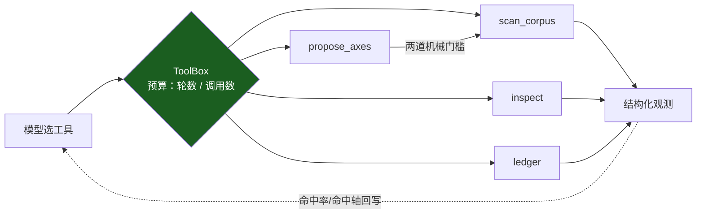
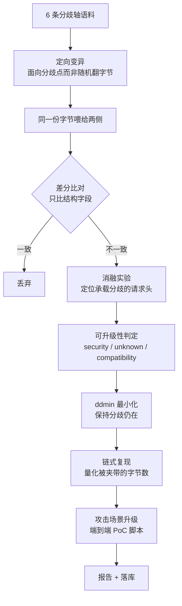

# CED — 产品耦合误差检测

> 客户把产品交给我们，我们找出它们在**串联处的耦合误差**。

单独看 nginx 没问题，单独看 gunicorn 没问题，但 `nginx + gunicorn` 就有 desync。
**漏洞不在组件里，在组件之间的语义缝隙里。**

传统 SCA 只看依赖的版本号，对 fork、自编译副本、被 vendor 进大项目的代码完全失效；
本工具不看版本号，看的是**两个实现读同一段字节时，谁读出了不同的边界**。

---

## 核心公式

$$\text{漏洞} \iff \text{语义分歧} \;\wedge\; \text{分歧点攻击者可控} \;\wedge\; \text{存在安全后果}$$

中间那一项是全部难点。本工具**不用规则猜**，而是用**消融实验**机械判定：

> 逐条移除请求头，重新把同一段字节喂给两侧 —— 如果分歧消失了，
> 说明这个分歧就是由那条请求头承载的；而请求头是攻击者可以直接发送的。
>
> 这就是「攻击者可控」的可复算证据，而不是一个形容词。

---

## 30 秒跑起来

**只需要 Python 3.11+。零第三方依赖，不需要 Docker，不需要联网。**

```bash
git clone https://github.com/weekendsunday/CED----.git
cd CED----

python main.py                    # 启动网页界面（推荐，点鼠标就行）
```

在 VSCode / PyCharm 里直接点运行按钮也行 —— 运行的就是 `main.py`。

其它入口：

```bash
python main.py --check                 # 跑自检（测试 + 已知案例反验证）
python main.py --probe                 # 同时起探针服务（接真实产品用）
python -m ced regression               # 已知案例反验证
python -m ced probe 请求文件            # 探测一份原始字节文件
python -m ced scan --mode axis --limit 60 --out report.md --db ced.db
```

### 网页界面做什么

| 面板 | 用途 |
|---|---|
| **扫描控制台** | 起一个扫描任务 → 事件流实时看进度 → 结果按 `security / unknown / compatibility` 分级；点开任一条看**证据视图**（双侧观测、消融证据、最小复现样本、链式复现） |
| **提案台账** | 模型提了多少条、通过准入实验几条、命中率多少；与手写轴**同一把尺子**对照 |
| **探测文件** | 拖入一份请求文件 → 看它在各实现之间有没有耦合误差，给出判定与最小复现样本 |
| **内置案例** | 9 个已知分歧类别，点开看原始字节、两侧观测、判定与证据 |
| **自检** | 一键跑已知案例反验证，确认程序本身是好的 |

任务与事件流都用标准库手写：后台线程跑扫描，`text/event-stream` 推进度，不引任何前端框架或 WebSocket 库。

---

## 实测效果

| 指标 | 数字 |
|---|---|
| 用例数 / 实现对 | 60 / 8 |
| 检出耦合误差 | **24** |
| 其中判为安全级 | **22**（CWE-444，场景 desync） |
| 已知案例反验证 | **9/9 通过** |
| 自动化测试 | **112 项全绿**（引擎 17 / 探针协议 2 / 链路端到端 5 / 模型提案层 36 / 扫描控制台 16 / 场景与 PoC 10 / 指标与热力图 11 / 闭环 agent 15） |
| 代码量 | 源码 53 文件 6383 行；测试 9 文件 2052 行 |
| 第三方依赖 | **0** —— 连模型调用（`urllib`）与前端事件流（手写 SSE）都是标准库 |

真实产出的一条发现（连同它自动生成的 PoC 脚本）：

```
最小复现样本：POST / HTTP/1.1\r\nContent-Length: 0000003\r\n\r\nabc
链式复现：若 ref-cl-first → ref-lenient-cl 串联：前置转发 44 字节，
          后端只消费 0 字节 → 44 字节被夹带，将成为下一条请求的开头
PoC 脚本：python results/pocs/poc_8b2611d2.py
          → 前置转发 39 字节 / 后端消费 0 字节 / 被夹带 39 字节
          → 断言 PASS
```

---

## 大模型在这里做什么（以及不做什么）

**大模型只提案，内核只裁决；不可实验的提案进不了结果。**

| | 大模型 | 确定性内核 |
|---|---|---|
| 能做 | 提出新的分歧轴、候选请求、搜索优先级 | 差分比对 → 消融实验 → 判定 → 最小化 → 链式复现 |
| 做不到 | 产出判定 —— `Proposal` 这个类型里**没有任何判定字段**（没有 level / cwe / scenario） | — |

一条模型提案要进语料，必须连过两道机械门槛：

1. **语法/白名单门槛** —— 请求必须能解析成一条 HTTP 消息，且必须落在分帧语法点上（CL/TE 写法与优先级、chunk 语法、头语法、请求行）；完全规范的请求直接丢弃。
2. **差分 oracle 准入实验** —— 把候选字节真的喂给本地对照对，只有**真的逼出结构分歧**才算命中。

没通过第二道门槛的提案，在结果里根本不存在 —— 幻觉不是被"抑制"，而是**在类型上无法表达**。
于是"模型有没有用"变成一个可复核的数字：命中率 = 逼出分歧的提案 / 全部提案，由内核给出，不看模型自述。

台账还会用**同一把尺子**先量一遍内置手写轴，给出可比基线：

```
提案 33　可编译 31　命中 15　命中率 45%
  模型   提案 4　命中 2　命中率 50%
  手写   提案 29　命中 13　命中率 45%
```

```bash
python -m ced assist                  # 看模型配置状态
python -m ced assist --ledger         # 提案命中率台账（模型 vs 手写轴）
python -m ced assist --propose 8      # 要 8 条提案并逐条跑准入实验
python -m ced scan --llm              # 带模型提案跑一次扫描
python -m ced agent --rounds 4        # 闭环：模型看上一轮结果决定下一步往哪搜
python -m ced web                     # 网页控制台里勾「使用模型提案」
```

### 闭环 agent：模型只看执行结果，不看代码

单次批量提案是**开环**。`ced agent` 把它接成闭环（对应 `docs/漏洞挖掘步骤.md` 里
「LLM 生成假设 + 执行反馈闭环筛选」那句）：



模型能调的每一个工具都是引擎**已有**的能力；它没有任何工具能写出 `level` / `cwe` / `scenario`
（有测试守着这条：`test_nothing_the_agent_says_becomes_a_finding`）。
预算（轮数、工具调用次数）是硬的，跑飞会被截断；没配置模型则**降级为单轮确定性扫描**，
结果与不带 agent 完全一致。

### 端到端 PoC：从「分歧」到「可执行复现」

只对 `security` 级发现升级（`unknown` / `compatibility` 一律不出 —— 不夸大）。
每个 PoC 含三样东西：

1. **攻击叙事** —— 场景（请求走私 / 防护绕过）、影响、前提、复现步骤；
2. **字节归属** —— 前置转发多少 / 后端消费多少 / 夹带多少，数字由链式模型算出，不是估的；
3. **可执行脚本** —— 零第三方依赖，离线算字节账；加 `--send HOST:PORT --i-am-authorized` 才真发。

```bash
python -m ced poc 8b2611d2 --out results/pocs      # 摊开一条发现的 PoC
python -m ced scan --out report.md --poc-dir results/pocs   # 扫描时自动产出全部 PoC
```

接入任意 OpenAI 兼容端点（**不配置就全链路自动降级为纯确定性模式**，扫描照跑）：

```bash
CED_LLM_BASE_URL=https://api.deepseek.com/v1
CED_LLM_MODEL=deepseek-chat
CED_LLM_API_KEY=sk-...
```

合规边界：只把公开语料（RFC 分帧语法、已有轴名、命中率摘要）发给模型，
**不发客户镜像、不发原始流量**。

---

## 它怎么工作



**6 条分歧轴**（每一类都有真实世界的分歧历史）：

`Content-Length` 写法 · `Transfer-Encoding` 写法 · CL/TE 并存 · 分块语法 · 头语法 · 请求行

**3 种观测方式**：

| runner | 观测的是什么 | 用在 |
|---|---|---|
| `local` | 进程内参照实现的解析结果 | 内部基准、可归因的复现 |
| `socket` | 直连探针收到的字节 | 任意位置的字节流 |
| `chain` | **真实前置转发出去的字节** | 客户产品的真实链路 |

---

## 模块划分

| 模块 | 文件 | 职责 |
|---|---|---|
| 分帧内核 | `ced/impls/http_reader.py` | 可配置的 HTTP/1.1 分帧解析器（全平台唯一解析真源） |
| 参照实现 | `ced/impls/reference.py` | 9 个"只在一个策略点上不同"的实现 |
| 领域适配器 | `ced/adapters/` | 协议 + HTTP/1.1 分帧（6 条轴、分歧分类、CWE 映射） |
| 变异 | `ced/mutate/` | 轴语料 + 确定性定向变异 |
| 探针 | `ced/probe/` | local / socket / chain 三种观测源 + 探针服务 |
| 差分 | `ced/differ/` | 引擎的 oracle（**只比较结构字段**） |
| 判定 | `ced/classify/` | 消融实验 → security / unknown / compatibility |
| 最小化 | `ced/minimize/` | ddmin + 语义保持 |
| 编排 | `ced/orchestrate/` | 拓扑解析、链式复现模型 |
| 反验证 | `ced/regression.py` + `ced/cases/known/` | 9 类已知案例，期望值独立于工具输出 |
| 模型提案层 | `ced/assist/` | 严格校验 → 语法门槛 → 差分 oracle 准入实验 → 命中率台账（**不产出任何判定**） |
| 闭环 agent | `ced/agent/` | 工具表 + 闭环编排；模型只能选"下一步往哪里搜"，预算硬上限（**不产出判定**） |
| 攻击场景 | `ced/scenario/` | 场景模板 + 端到端 PoC（叙事 / 字节归属 / 可执行脚本） |
| 指标 | `ced/metrics.py` | 指标自动出数 + 交叉矩阵热力图 |
| 扫描任务 | `ced/scan/` | 任务状态机、后台执行、事件流、中止时保留已完成部分 |
| 控制台 | `ced/web/` | 零依赖 `ThreadingHTTPServer` + 单页前端；模型文字与确定性证据**分栏**渲染 |
| 真实链路 | `docker/` + `ced/probe/front.py` | Docker compose（**本机无 Docker，交由队友验证**）与无 Docker 的替身前置 |

新增一个领域 = 实现 `DomainAdapter` 协议并在注册表登记，**引擎一行都不用改**。
详见 [`docs/部署运行说明.md`](docs/部署运行说明.md) 第 4 节。

---

## 几个刻意的设计决定

| 决定 | 为什么 |
|---|---|
| 只比较**结构字段** | 从源头杜绝"拿报错文案不同当漏洞"——有测试守着这条不变式 |
| 可控性用**消融实验**而非规则 | 规则会把"两个实现报错细节不同"升级成漏洞 |
| 探测失败一律**抛错**，绝不合成观测 | 合成出来的观测必然与基线不同，会把"没跑通"变成成片的假阳性安全结论 |
| 探针**不用空闲超时**判定输入结束 | 客户端发完即半关闭，服务端读到 EOF 立即处理，消除竞态 |
| **零字节观测一律跳过** | 端口探活产生的空连接不可能对应非空请求 |
| 参照实现只偏离基线**一个策略点** | 每个分歧都能归因到具体的分帧策略 |
| 已知案例的期望值**独立手写** | 期望值来自 RFC / 公开研究，不是工具输出，回归才有参考价值 |
| 前置**拒绝**畸形请求 ≠ 链路故障 | 真实 nginx 对畸形请求返回 4xx 且不转发；若当故障处理，一轮扫描会在第一条畸形请求上崩掉。这类用例**跳过并计数**——既不合成观测，也不中止 |
| agent **没有**判定工具 | 它只能选"下一步往哪里搜"；发现只来自内核。有测试守着：`test_nothing_the_agent_says_becomes_a_finding` |

---

## 已知案例反验证

```bash
python -m ced regression
```

9 个类别，每个都标注 RFC 出处与预期分歧字段：

| 案例 | 分歧点 |
|---|---|
| `cl-te-conflict` | CL 与 TE 并存（经典走私结构） |
| `dup-cl-conflict` | 冲突的重复 Content-Length |
| `te-bad-token` | 非标准 Transfer-Encoding token |
| `cl-leading-zero` | `Content-Length: 03` 前导零 |
| `header-name-space` | `Content-Length : 3` 冒号前空格 |
| `obs-fold` | 折行头 |
| `te-case-sensitive` | 编码名大小写 |
| `chunk-bare-lf` | 分块行尾用裸 LF |
| `request-line-absolute-uri` | 请求行为绝对形式（一侧放行、一侧拒绝） |

> **先证明能重新挖出已知的，再谈能发现未知的。**

---

## 合规声明

- 仅在本机容器矩阵与**已获授权**的链路上运行，不针对任何未授权的真实目标实施测试。
- 不要求客户提供源码，全程黑盒观测，只读取字节流。
- 判定结论不夸大：未通过可控性消融的分歧一律标为 `unknown`，不作漏洞结论。

---

## 目录

| 路径 | 说明 |
|---|---|
| `ced/` | 源代码 |
| `ced/assist/` | 大模型提案层（schema / client / compile / ledger / propose） |
| `ced/agent/` | 闭环 agent（tools / loop） |
| `ced/scenario/` | 攻击场景模板与端到端 PoC |
| `ced/scan/` | 扫描任务层（job / runner） |
| `ced/web/` | 网页控制台（server.py + index.html） |
| `docker/` | 真实 nginx → 探针链路（compose / 离线快照 / **队友验证清单**） |
| `tests` | `ced/tests/` —— 112 项，`python main.py --check` 一键全跑 |
| `docs/部署运行说明.md` | 部署、运行、扩展、排错 |
| `docs/技术方案.md` | 目标对象、服务形态、指标、排期 |
| `docs/队友交接清单.md` | 不读代码也能执行的验证 / 录屏 / 校对清单 |
| `results/` | 跑出来的报告、结果库与 PoC 脚本 |
| `main.py` | 启动入口：起网页控制台 / 跑自检 |

---

## License

[MIT](LICENSE)
