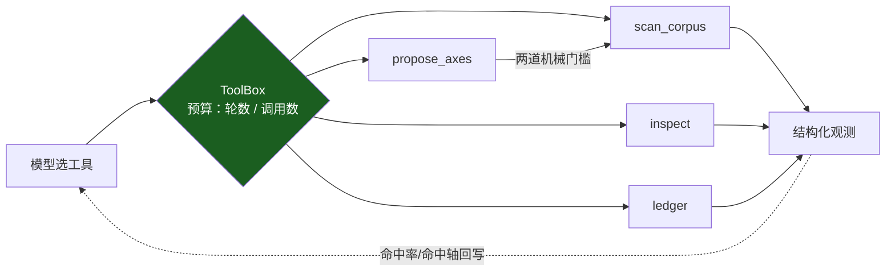
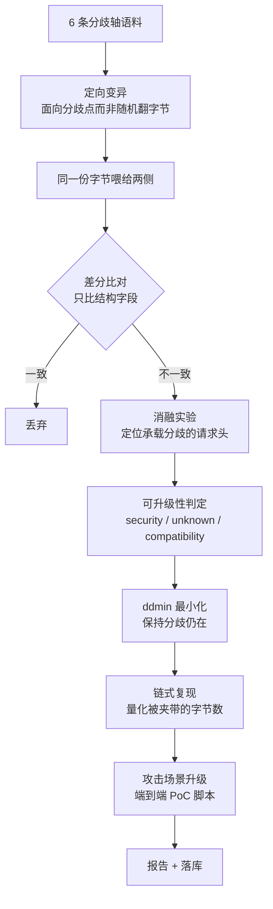

# CED — 产品耦合误差检测

> 客户把产品交给我们，我们找出它们在**串联处的耦合误差**。

单独看 nginx 没问题，单独看 gunicorn 没问题，但 `nginx + gunicorn` 就有 desync。
**漏洞不在组件里，在组件之间的语义缝隙里。**

传统 SCA 只看依赖的版本号，对 fork、自编译副本、被 vendor 进大项目的代码完全失效；
本工具不看版本号，看的是**两个实现读同一段字节时，谁读出了不同的边界**。

---

## 核心公式

$$\text{漏洞} \iff \text{语义分歧} \;\wedge\; \text{分歧点攻击者可控} \;\wedge\; \text{存在安全后果}$$

中间那一项是全部难点。本工具**不用规则猜**，而是用**消融实验**机械判定：

> 逐条移除请求头，重新把同一段字节喂给两侧 —— 如果分歧消失了，
> 说明这个分歧就是由那条请求头承载的；而请求头是攻击者可以直接发送的。
>
> 这就是「攻击者可控」的可复算证据，而不是一个形容词。

---

## 30 秒跑起来

**只需要 Python 3.11+。零第三方依赖，不需要 Docker，不需要联网。**

```bash
git clone https://github.com/weekendsunday/CED----.git
cd CED----

python main.py                    # 启动网页界面（推荐，点鼠标就行）
```

在 VSCode / PyCharm 里直接点运行按钮也行 —— 运行的就是 `main.py`。

其它入口：

```bash
python main.py --check                 # 跑自检（测试 + 已知案例反验证）
python main.py --probe                 # 同时起探针服务（接真实产品用）
python -m ced regression               # 已知案例反验证
python -m ced probe 请求文件            # 探测一份原始字节文件
python -m ced probe 请求文件 --domain url-norm   # 指定领域（默认分帧；共 5 个）
python -m ced capture --port 18081     # 自动捕获：浏览器/系统代理指向它，请求自动进差分
python -m ced scan --mode axis --limit 60 --out report.md --db ced.db
```

### 网页界面做什么

| 面板 | 用途 |
|---|---|
| **检测**（唯一入口） | 把东西粘/拖进来，或点「自动捕获」让请求自己流进来，或从「**载入示例**」里直接挑一个 → **它自己判断这是什么**（HTTP 请求原始字节 / nuclei / Burp / HAR / curl / URL 清单）→ **自己调用对应工具**跑完整链路：扇出 5 个领域 → 逐对差分 → 消融判定 → 升级 PoC → 出报告。**DAG 实时显示跑到哪一步**，**报告边跑边吐**。**「开始自动捕获」就在「开始检测」旁边**（同一个卡里：端口 → 起本机代理 → 请求自动流进来），捕获结果（统计 + 列表 + 证据 + 一键 PoC）就在下方。原来的扫描控制台 / 验证外部发现 / 探测文件收在这一页的折叠区里（入口归一，功能不减） |
| **设置** | 所有可配置项集中一处：**模型 API 接入**（base_url / model / key / 超时 / 温度 / max_tokens）、自动捕获默认值、扫描默认值、输出路径。保存即生效（服务启动时也会自动加载），密钥只回显掩码、绝不入库。模型提案台账也在这里 |
| **自检** | 一键跑已知案例反验证（47/47）；内置案例库（47 个）点开看两侧观测与判定 |

任务与事件流都用标准库手写：后台线程跑、`text/event-stream` 推事件（扫描进度、以及检测的**阶段 / 报告行 / 发现**都走这条通道），不引任何前端框架或 WebSocket 库。

---

## 实测效果

| 指标 | 数字 |
|---|---|
| 领域 | **5 个**：`http1-framing` · `url-norm` · `host-norm` · `query-norm` · `enc-norm` |
| 参照实现 / 定向对照 | 9+12+9+11+10 = **51 个参照实现**，8+11+8+10+10 = **47 对定向对照** |
| 能指出的漏洞类别 | **6 类**：请求走私 · 鉴权绕过/路径穿越 · 虚拟主机绕过/缓存投毒 · 参数污染 · 过滤器绕过 |
| 实测（每领域 40 用例） | 分帧 13/11 · 路径 82/68 · Host 90/83 · 查询串 100/96 · 编码 82/52（分歧 / 其中安全级） |
| 真实 Docker 链路 | 实机跑通两个真实产品：`nginx:1.25.5`（4 用例 / 拒绝 9 条 / 0 安全级）与 `nginx → gunicorn` 第二档（12 用例 / 拒绝 91 条 / 55 分歧 / 1 安全级）。换第三种产品（**haproxy 2.9**）**零代码改动**即可观测，并抓到一条 security 级发现（重复 `Host` 头被合并 → 转发字节数少 17 字节）。实测对照：**同一份字节，nginx 对 CL+TE 直接 400、把 chunked 解成 CL，haproxy 却按 TE 转发、原样保留 chunked** —— 明细见 `docker/README.md` |
| 报告可读性 | 按「同一对实现 + 同一分歧类型」归并：分帧 13→**3** · 路径 82→**14** · Host 90→**6** · 查询串 100→**15** · 编码 82→**9**（发现 → 类；冗余最高 **15.0×**） |
| 已知案例反验证 | **47/47 通过**（期望值全部独立手写，来自 RFC / 公开先例，不是工具输出） |
| 自动化测试 | **227 项全绿**（引擎 19 / 探针协议 2 / 链路端到端 8 / 模型提案层 36 / 扫描控制台 16 / 场景与 PoC 10 / 指标与热力图 11 / 闭环 agent 15 / 路径归一化 9 / Host 12 / 查询串 11 / 编码 11 / 验证层 20 / 发现归并 9 / 探针领域化 7 / 自动捕获 14 / 单一入口与设置 11 / 样本自验证 6） |
| 代码量 | 源码 81 文件 13636 行；测试 21 文件 4552 行；前端单页 2276 行 |
| 第三方依赖 | **0** —— 连模型调用（`urllib`）与前端事件流（手写 SSE）都是标准库 |

> 数字一律从代码里数出来再写（`python main.py --check`、`python -m ced impls`、
> `find ced -name '*.py' …`），不凭记忆 —— 材料与实现不一致是「材料规范性」的直接扣分点。

真实产出的一条发现（连同它自动生成的 PoC 脚本）：

```
最小复现样本：POST / HTTP/1.1\r\nContent-Length: 0000003\r\n\r\nabc
链式复现：若 ref-cl-first → ref-lenient-cl 串联：前置转发 44 字节，
          后端只消费 0 字节 → 44 字节被夹带，将成为下一条请求的开头
PoC 脚本：python results/pocs/poc_8b2611d2.py
          → 前置转发 39 字节 / 后端消费 0 字节 / 被夹带 39 字节
          → 断言 PASS
```

---

## 大模型在这里做什么（以及不做什么）

**大模型只提案，内核只裁决；不可实验的提案进不了结果。**

| | 大模型 | 确定性内核 |
|---|---|---|
| 能做 | 提出新的分歧轴、候选请求、搜索优先级 | 差分比对 → 消融实验 → 判定 → 最小化 → 链路量化 |
| 做不到 | 产出判定 —— `Proposal` 这个类型里**没有任何判定字段**（没有 level / cwe / scenario） | — |

一条模型提案要进语料，必须连过两道机械门槛：

1. **语法/白名单门槛** —— 请求必须能解析成一条 HTTP 消息，且必须落在分帧语法点上（CL/TE 写法与优先级、chunk 语法、头语法、请求行）；完全规范的请求直接丢弃。
2. **差分 oracle 准入实验** —— 把候选字节真的喂给本地对照对，只有**真的逼出结构分歧**才算命中。

没通过第二道门槛的提案，在结果里根本不存在 —— 幻觉不是被"抑制"，而是**在类型上无法表达**。
于是"模型有没有用"变成一个可复核的数字：命中率 = 逼出分歧的提案 / 全部提案，由内核给出，不看模型自述。

台账还会用**同一把尺子**先量一遍内置手写轴，给出可比基线：

```
提案 33　可编译 31　命中 15　命中率 45%
  模型   提案 4　命中 2　命中率 50%
  手写   提案 29　命中 13　命中率 45%
```

```bash
python -m ced assist                  # 看模型配置状态
python -m ced assist --ledger         # 提案命中率台账（模型 vs 手写轴）
python -m ced assist --propose 8      # 要 8 条提案并逐条跑准入实验
python -m ced scan --llm              # 带模型提案跑一次扫描
python -m ced agent --rounds 4        # 闭环：模型看上一轮结果决定下一步往哪搜
python -m ced web                     # 网页控制台里勾「使用模型提案」
```

### 闭环 agent：模型只看执行结果，不看代码

单次批量提案是**开环**。`ced agent` 把它接成闭环（对应 `docs/漏洞挖掘步骤.md` 里
「LLM 生成假设 + 执行反馈闭环筛选」那句）：



模型能调的每一个工具都是引擎**已有**的能力；它没有任何工具能写出 `level` / `cwe` / `scenario`
（有测试守着这条：`test_nothing_the_agent_says_becomes_a_finding`）。
预算（轮数、工具调用次数）是硬的，跑飞会被截断；没配置模型则**降级为单轮确定性扫描**，
结果与不带 agent 完全一致。

### 端到端 PoC：从「分歧」到「可执行复现」

只对 `security` 级发现升级（`unknown` / `compatibility` 一律不出 —— 不夸大）。
每个 PoC 含三样东西：

1. **攻击叙事** —— 场景（请求走私 / 防护绕过）、影响、前提、复现步骤；
2. **字节归属** —— 前置转发多少 / 后端消费多少 / 夹带多少，数字由链式模型算出，不是估的；
3. **可执行脚本** —— 零第三方依赖，离线算字节账；加 `--send HOST:PORT --i-am-authorized` 才真发。

```bash
python -m ced poc 8b2611d2 --out results/pocs      # 摊开一条发现的 PoC
python -m ced scan --out report.md --poc-dir results/pocs   # 扫描时自动产出全部 PoC
```

### 验证外部发现：做扫描器的裁判

攻击面可以靠加领域变宽（引擎零改动），但更值钱的是**输入面**变宽：别人的命中也能进来。

`ced verify` 把 nuclei / Burp / HAR / curl / 普通清单里的每一条当成**待验证的假设**，
用与扫描**完全相同**的链路（差分 → 消融 → 判定 → 最小化）给出三态结论：

| 结论 | 判据 |
|---|---|
| **已证实** | 至少一对实现产生了结构分歧（级别由内核给出，**不是报告方的自述**） |
| **未证实** | 试过的那几个领域里，所有实现对这份输入理解一致（**不等于**这条发现是假的） |
| **证不了** | 没有任何领域的解析器能接受这份输入（会写清缺什么，例如"缺完整请求字节"） |

```bash
python -m ced verify findings.json --format nuclei --out verify.md
python -m ced verify burp-sitemap.xml          # 按扩展名自动识别格式
cat urls.txt | python -m ced verify -           # 从 stdin 读
```

控制台里对应「**验证外部发现**」标签页：贴进去点一下。

接入任意 OpenAI 兼容端点（**不配置就全链路自动降级为纯确定性模式**，扫描照跑）：

```bash
CED_LLM_BASE_URL=https://api.deepseek.com/v1
CED_LLM_MODEL=deepseek-chat
CED_LLM_API_KEY=sk-...
```

合规边界：只把公开语料（RFC 分帧语法、已有轴名、命中率摘要）发给模型，
**不发客户镜像、不发原始流量**。

---

## 它怎么工作



**6 条分歧轴**（每一类都有真实世界的分歧历史）：

`Content-Length` 写法 · `Transfer-Encoding` 写法 · CL/TE 并存 · 分块语法 · 头语法 · 请求行

**3 种观测方式**：

| runner | 观测的是什么 | 用在 |
|---|---|---|
| `local` | 进程内参照实现的解析结果 | 内部基准、可归因的复现 |
| `socket` | 直连探针收到的字节 | 任意位置的字节流 |
| `chain` | **真实前置转发出去的字节** | 客户产品的真实链路 |

---

## 能力边界：现在能测什么、不能测什么

**一句话**：CED 只做一件事 —— 找出**两个实现**对**同一份字节**在「这是哪个请求 / 这是哪个资源」上的理解差异，并用消融实验机械判定这个差异能不能被攻击者利用。

它的攻击面是**语义归一化**，不是"Web 漏洞"。当前实现**两个领域**：

| 领域 | 观测对象 | 覆盖 | 能指出的漏洞类别 | 判定依据 |
|---|---|---|---|---|
| `http1-framing` | 一条 HTTP/1.1 请求 | 9 实现 · 8 对轴 | **请求走私**（CL.TE / TE.CL / TE.TE）→ 前置防护绕过 · CWE-444 | 两侧消费的字节数不同 ∧ 差额字节可控 |
| `url-norm` | 一个请求目标 | 12 实现 · 11 对轴 | **鉴权绕过 / 路径穿越**（含过长 UTF-8、NUL 截断）· CWE-22 / CWE-863 | 两侧归一化出的资源不同 ∧ 差异字节可控 |
| `host-norm` | Host 头的值 | 9 实现 · 8 对轴 | **虚拟主机绕过 / 缓存投毒**（尾随点、大小写、默认端口、userinfo、IDN、IP 字面量）· CWE-436 | 两侧认成不同站点 ∧ 差异字节可控 |
| `query-norm` | 查询串字节 | 11 实现 · 10 对轴 | **参数污染**（分隔符、重复参数取首/取尾、二次解码、`a[]`、排序）· CWE-235 | 两侧解析出不同参数集/取值 ∧ 可控 |
| `enc-norm` | 一段待解释的字节 | 10 实现 · 10 对轴 | **过滤器绕过**（过长 UTF-8、NFC/NFD、全角、`%uXXXX`、字节编码、NUL）· CWE-180 | 检查侧与执行侧的解释不同 ∧ 可控 |

**做不到的**（同一份清单也是答辩时的边界声明）：

| 做不到 | 说明 |
|---|---|
| 错误处理 / 状态机类分歧 | 设计上支持（`DomainAdapter` 协议），但**尚未实现** |
| 注入类 / 反序列化 / SSRF / XSS | 不在这套 oracle 的能力范围内 |
| 资产发现 / 端口扫描 / 指纹 / CVE 匹配 | 完全不做 |
| 读源码做数据流分析 | 全程黑盒，只读字节流 |
| HTTP/2 / HTTP/3 | 只有 HTTP/1.1 |
| HTTPS 明文 | 不做 TLS 拆解：自动捕获只做 `CONNECT` 隧道直通（看不到 HTTPS 请求内容） |

**用它的前提**（不满足就跑不出东西）：

1. 必须是**两个实现**的场景：真实产品走 `runner=chain/socket`（探针放在前置后面），或用内置参照实现做基准。
2. 前置必须**转发**：真实 nginx 对畸形请求返回 4xx 且不转发，这类用例会被**跳过并计数**，既不伪造观测也不中止扫描。
3. 真实链路每条用例约 5 秒（nginx 不对上游半关闭，探针要等空闲超时）→ 必须带 `--limit`。
4. 单个产品自己测不出来 —— 这正是产品定位：客户各自测各自都正常，串起来才有缝。

> ⚠️ **`security` 的含义是「结构性前提成立」，不等于「已被利用」。**
> 两个领域都是这个口径：分帧 = 消息边界分歧 ∧ 由攻击者可直接发送的字节承载；
> 路径 = 两侧归一化出的资源不同 ∧ 差异字节可控。
> 所以每条发现都配**最小复现样本 + 端到端 PoC 脚本**供人复核；
> 未通过可控性消融的分歧一律标 `unknown`，不作结论。

---

## 模块划分

| 模块 | 文件 | 职责 |
|---|---|---|
| 领域适配器 | `ced/adapters/` | **5 个领域**（分帧 / 路径 / Host / 查询串 / 编码）；各自持有语料、分类、消融、量化、最小化、PoC 片段。类上加 `@register` 即接入，引擎零改动 |
| 分帧内核 | `ced/impls/http_reader.py` | 可配置的 HTTP/1.1 分帧解析器（分帧领域唯一解析真源） |
| 路径内核 | `ced/impls/path_norm.py` | 可配置的 URL 路径归一化器（路径领域唯一解析真源） |
| 其它领域内核 | `ced/impls/{host,query,enc}_norm.py` | Host / 查询串 / 编码解释三个领域各自的解析内核 |
| 参照实现 | `ced/impls/reference.py` · `url_reference.py` | 9 + 10 个"只在一个策略点上不同"的实现 |
| 变异 | `ced/mutate/` | 轴语料 + 确定性定向变异（分帧与路径各一套） |
| 探针 | `ced/probe/` | local / socket / chain 三种观测源 + 探针服务 |
| 差分 | `ced/differ/` | 引擎的 oracle（**只比较结构字段**） |
| 判定 | `ced/classify/` | 消融实验 → security / unknown / compatibility |
| 最小化 | `ced/minimize/` | ddmin + 语义保持 |
| 编排 | `ced/orchestrate/` | 拓扑解析、链式复现模型 |
| 反验证 | `ced/regression.py` + `ced/cases/known/` | 18 类已知案例（两个领域各 9），期望值独立于工具输出 |
| 模型提案层 | `ced/assist/` | 严格校验 → 语法门槛 → 差分 oracle 准入实验 → 命中率台账（**不产出任何判定**） |
| 闭环 agent | `ced/agent/` | 工具表 + 闭环编排；模型只能选"下一步往哪里搜"，预算硬上限（**不产出判定**） |
| 攻击场景 | `ced/scenario/` | 场景模板 + 端到端 PoC（叙事 / 字节归属 / 可执行脚本） |
| 指标 | `ced/metrics.py` | 指标自动出数 + 交叉矩阵热力图 |
| 扫描任务 | `ced/scan/` | 任务状态机、后台执行、事件流、中止时保留已完成部分 |
| 控制台 | `ced/web/` | 零依赖 `ThreadingHTTPServer` + 单页前端；模型文字与确定性证据**分栏**渲染 |
| 验证层 | `ced/intake/` | 外部发现（nuclei / Burp / HAR / curl / 清单）→ 假设 → 三态验证（已证实 / 未证实 / 证不了） |
| 自动捕获 | `ced/capture/` | 本机 HTTP 代理：收到的请求**自动**进同一个 oracle（一条请求扇出 5 个领域、同字节去重计数、静态资源默认跳过）；HTTPS 只做 `CONNECT` 直通不拆包 |
| 单一入口 | `ced/detect.py` | **自动识别输入形态**（请求字节 / nuclei / Burp / HAR / curl / 清单）→ **自动选路** → 跑完整链路；阶段、报告行、发现都是实时事件（前端的 DAG 与实时报告就是它吐出来的） |
| 设置 | `ced/settings.py` | 网页「设置」的持久化（`ced-settings.json`，已 gitignore）；模型配置写回 `CED_LLM_*`；密钥只回显掩码 |
| 真实链路 | `docker/` + `ced/probe/front.py` | Docker compose（**本机已装 Docker Desktop 4.93 并实机跑通**，见 `docker/README.md`）与无 Docker 的替身前置 |

新增一个领域 = 实现 `DomainAdapter` 协议并在注册表登记，**引擎一行都不用改**。
详见 [`docs/部署运行说明.md`](docs/部署运行说明.md) 第 4 节。

---

## 几个刻意的设计决定

| 决定 | 为什么 |
|---|---|
| 只比较**结构字段** | 从源头杜绝"拿报错文案不同当漏洞"——有测试守着这条不变式 |
| 可控性用**消融实验**而非规则 | 规则会把"两个实现报错细节不同"升级成漏洞 |
| 探测失败一律**抛错**，绝不合成观测 | 合成出来的观测必然与基线不同，会把"没跑通"变成成片的假阳性安全结论 |
| 探针**不用空闲超时**判定输入结束 | 客户端发完即半关闭，服务端读到 EOF 立即处理，消除竞态 |
| **零字节观测一律跳过** | 端口探活产生的空连接不可能对应非空请求 |
| 参照实现只偏离基线**一个策略点** | 每个分歧都能归因到具体的分帧策略 |
| 已知案例的期望值**独立手写** | 期望值来自 RFC / 公开研究，不是工具输出，回归才有参考价值 |
| 前置**拒绝**畸形请求 ≠ 链路故障 | 真实 nginx 对畸形请求返回 4xx 且不转发；若当故障处理，一轮扫描会在第一条畸形请求上崩掉。这类用例**跳过并计数**——既不合成观测，也不中止 |
| agent **没有**判定工具 | 它只能选"下一步往哪里搜"；发现只来自内核。有测试守着：`test_nothing_the_agent_says_becomes_a_finding` |

---

## 已知案例反验证

```bash
python -m ced regression
```

47 个类别（5 个领域），每个都标注 RFC 出处与预期分歧字段（见各案例文件的
`reference` / `note`）。案例按自己的 `domain` 字段选适配器 —— 加领域不需要改反验证器。

| 领域 | 案例数 | 覆盖点 |
|---|---|---|
| `http1-framing` | 9 | CL/TE 并存与优先级、CL 写法（前导零）、重复 CL、TE token 与大小写、折行头、裸 LF、绝对 URI |
| `url-norm` | 11 | `..` 解算、解码层数、百分号大小写、反斜杠、连续斜杠、尾随点、矩阵参数、路径大小写、`%2F`、**过长 UTF-8**、**NUL 截断** |
| `host-norm` | 8 | 尾随点、大小写、默认端口、userinfo（`evil@victim`）、重复点、IDN、IPv6 字面量、百分号编码主机名 |
| `query-norm` | 10 | 分隔符含 `;`、重复参数取首/取尾/全要、解码层数、二次解码、`+` 是否当空格、空值、`a[]`、参数名大小写、排序 |
| `enc-norm` | 9 | 过长 UTF-8、NFC/NFD、全角折叠、`%uXXXX`、孤立代理项、字节编码（UTF-8/Latin-1）、NUL 截断 |

> **先证明能重新挖出已知的，再谈能发现未知的。**
> 期望值全部**独立手写**（来自 RFC 与公开先例），不是工具输出 —— 回归才有参考价值。

---

## 合规声明

- 仅在本机容器矩阵与**已获授权**的链路上运行，不针对任何未授权的真实目标实施测试。
- 不要求客户提供源码，全程黑盒观测，只读取字节流。
- 判定结论不夸大：未通过可控性消融的分歧一律标为 `unknown`，不作漏洞结论。

---

## 目录

| 路径 | 说明 |
|---|---|
| `ced/` | 源代码 |
| `ced/assist/` | 大模型提案层（schema / client / compile / ledger / propose） |
| `ced/agent/` | 闭环 agent（tools / loop） |
| `ced/scenario/` | 攻击场景模板与端到端 PoC |
| `ced/intake/` | 验证层：外部发现解析与三态验证（做扫描器的裁判） |
| `ced/scan/` | 扫描任务层（job / runner） |
| `ced/web/` | 网页控制台（server.py + index.html） |
| `docker/` | 真实 nginx → 探针链路（compose / 离线快照 / 实机验证记录与实际测到的定帧行为） |
| `tests` | `ced/tests/` —— 191 项，`python main.py --check` 一键全跑 |
| `docs/部署运行说明.md` | 部署、运行、扩展、排错 |
| `docs/技术方案.md` | 目标对象、服务形态、指标、排期 |
| `results/` | 跑出来的报告、结果库与 PoC 脚本（样例报告可由 `python -m ced scan --domain http1-framing --mode axis --limit 60 --poc-dir results/pocs` 原样重建，22 个 PoC 脚本逐字节一致） |
| `samples/` | **可测试样本**：10 个原始请求（覆盖 5 个领域 + 1 个对照组）+ 5 种外部格式；每个文件的结论都是实跑出来的，`ced/tests/test_samples.py` 盯着它不许失真 |
| `main.py` | 启动入口：起网页控制台 / 跑自检 |

---

## License

[MIT](LICENSE)
