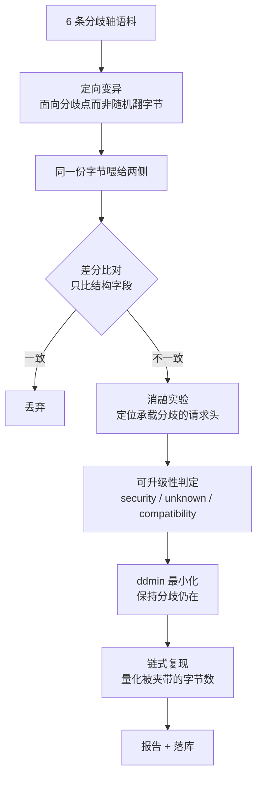

# CED — 产品耦合误差检测

> 客户把产品交给我们，我们找出它们在**串联处的耦合误差**。

单独看 nginx 没问题，单独看 gunicorn 没问题，但 `nginx + gunicorn` 就有 desync。
**漏洞不在组件里，在组件之间的语义缝隙里。**

传统 SCA 只看依赖的版本号，对 fork、自编译副本、被 vendor 进大项目的代码完全失效；
本工具不看版本号，看的是**两个实现读同一段字节时，谁读出了不同的边界**。

---

## 核心公式

$$\text{漏洞} \iff \text{语义分歧} \;\wedge\; \text{分歧点攻击者可控} \;\wedge\; \text{存在安全后果}$$

中间那一项是全部难点。本工具**不用规则猜**，而是用**消融实验**机械判定：

> 逐条移除请求头，重新把同一段字节喂给两侧 —— 如果分歧消失了，
> 说明这个分歧就是由那条请求头承载的；而请求头是攻击者可以直接发送的。
>
> 这就是「攻击者可控」的可复算证据，而不是一个形容词。

---

## 30 秒跑起来

**只需要 Python 3.11+。零第三方依赖，不需要 Docker，不需要联网。**

```bash
git clone https://github.com/weekendsunday/CED----.git
cd CED----

python -m ced web                 # 打开网页界面（推荐，点鼠标就行）
```

不想用界面 —— 全部命令：

```bash
python -m ced regression               # 已知案例反验证
python -m ced probe 请求文件            # 探测一份原始字节文件
python -m ced case <id>                # 摊开一个已知案例
python -m ced scan --mode axis --limit 60 --out report.md --db ced.db
```

Windows 上也可以直接双击 `selfcheck.bat`。

### 网页界面做什么

| 面板 | 用途 |
|---|---|
| **探测文件** | 拖入一份请求文件 → 看它在各实现之间有没有耦合误差，给出判定与最小复现样本 |
| **内置案例** | 9 个已知分歧类别，点开看原始字节、两侧观测、判定与证据 |
| **自检** | 一键跑已知案例反验证，确认程序本身是好的 |

---

## 实测效果

| 指标 | 数字 |
|---|---|
| 用例数 / 实现对 | 60 / 8 |
| 检出耦合误差 | **24** |
| 其中判为安全级 | **22**（CWE-444，场景 desync） |
| 已知案例反验证 | **9/9 通过** |
| 自动化测试 | **24 项全绿**（引擎 17 / 探针协议 2 / 链路端到端 5） |
| 代码量 | 源码 33 文件 2577 行；测试 4 文件 625 行 |
| 第三方依赖 | **0** |

真实产出的一条发现：

```
最小复现样本：POST / HTTP/1.1\r\nContent-Length: 0000003\r\n\r\nabc
链式复现：若 ref-cl-first → ref-lenient-cl 串联：前置转发 44 字节，
          后端只消费 0 字节 → 44 字节被夹带，将成为下一条请求的开头
```

---

## 它怎么工作



**6 条分歧轴**（每一类都有真实世界的分歧历史）：

`Content-Length` 写法 · `Transfer-Encoding` 写法 · CL/TE 并存 · 分块语法 · 头语法 · 请求行

**3 种观测方式**：

| runner | 观测的是什么 | 用在 |
|---|---|---|
| `local` | 进程内参照实现的解析结果 | 内部基准、可归因的复现 |
| `socket` | 直连探针收到的字节 | 任意位置的字节流 |
| `chain` | **真实前置转发出去的字节** | 客户产品的真实链路 |

---

## 模块划分

| 模块 | 文件 | 职责 |
|---|---|---|
| 分帧内核 | `ced/impls/http_reader.py` | 可配置的 HTTP/1.1 分帧解析器（全平台唯一解析真源） |
| 参照实现 | `ced/impls/reference.py` | 9 个"只在一个策略点上不同"的实现 |
| 领域适配器 | `ced/adapters/` | 协议 + HTTP/1.1 分帧（6 条轴、分歧分类、CWE 映射） |
| 变异 | `ced/mutate/` | 轴语料 + 确定性定向变异 |
| 探针 | `ced/probe/` | local / socket / chain 三种观测源 + 探针服务 |
| 差分 | `ced/differ/` | 引擎的 oracle（**只比较结构字段**） |
| 判定 | `ced/classify/` | 消融实验 → security / unknown / compatibility |
| 最小化 | `ced/minimize/` | ddmin + 语义保持 |
| 编排 | `ced/orchestrate/` | 拓扑解析、链式复现模型 |
| 反验证 | `ced/regression.py` + `ced/cases/known/` | 8 类已知案例，期望值独立于工具输出 |

新增一个领域 = 实现 `DomainAdapter` 协议并在注册表登记，**引擎一行都不用改**。
详见 [`docs/部署运行说明.md`](docs/部署运行说明.md) 第 4 节。

---

## 几个刻意的设计决定

| 决定 | 为什么 |
|---|---|
| 只比较**结构字段** | 从源头杜绝"拿报错文案不同当漏洞"——有测试守着这条不变式 |
| 可控性用**消融实验**而非规则 | 规则会把"两个实现报错细节不同"升级成漏洞 |
| 探测失败一律**抛错**，绝不合成观测 | 合成出来的观测必然与基线不同，会把"没跑通"变成成片的假阳性安全结论 |
| 探针**不用空闲超时**判定输入结束 | 客户端发完即半关闭，服务端读到 EOF 立即处理，消除竞态 |
| **零字节观测一律跳过** | 端口探活产生的空连接不可能对应非空请求 |
| 参照实现只偏离基线**一个策略点** | 每个分歧都能归因到具体的分帧策略 |
| 已知案例的期望值**独立手写** | 期望值来自 RFC / 公开研究，不是工具输出，回归才有参考价值 |

---

## 已知案例反验证

```bash
python -m ced regression
```

9 个类别，每个都标注 RFC 出处与预期分歧字段：

| 案例 | 分歧点 |
|---|---|
| `cl-te-conflict` | CL 与 TE 并存（经典走私结构） |
| `dup-cl-conflict` | 冲突的重复 Content-Length |
| `te-bad-token` | 非标准 Transfer-Encoding token |
| `cl-leading-zero` | `Content-Length: 03` 前导零 |
| `header-name-space` | `Content-Length : 3` 冒号前空格 |
| `obs-fold` | 折行头 |
| `te-case-sensitive` | 编码名大小写 |
| `chunk-bare-lf` | 分块行尾用裸 LF |
| `request-line-absolute-uri` | 请求行为绝对形式（一侧放行、一侧拒绝） |

> **先证明能重新挖出已知的，再谈能发现未知的。**

---

## 合规声明

- 仅在本机容器矩阵与**已获授权**的链路上运行，不针对任何未授权的真实目标实施测试。
- 不要求客户提供源码，全程黑盒观测，只读取字节流。
- 判定结论不夸大：未通过可控性消融的分歧一律标为 `unknown`，不作漏洞结论。

---

## 目录

| 路径 | 说明 |
|---|---|
| `ced/` | 源代码 |
| `docs/部署运行说明.md` | 部署、运行、扩展、排错 |
| `docs/技术方案.md` | 目标对象、服务形态、指标、排期 |
| `results/` | 跑出来的报告与结果库 |
| `selfcheck.bat` | Windows 一键自检 |

---

## License

[MIT](LICENSE)
