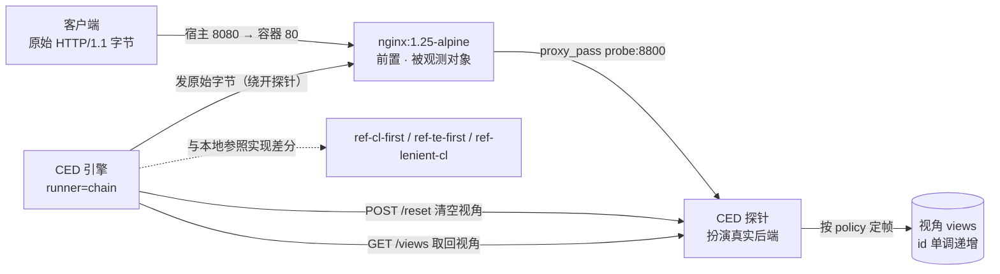

# docker/ —— 真实链路演示栈（nginx 前置 → 探针扮演后端）

> **本机没有安装 Docker，所以这套 compose 栈尚未实机验证。**
> 未验证项与「本机实际验证过什么」都写在下面两节里，请按未验证清单自行核对一遍再上场比赛。
> 逐字保留的纪律：本文件里凡是标着「实测」的输出都是在**本开发机**上真实跑出来的；
> 标着「期望」的都是按代码推断、**没有**跑过 Docker 部分。

---

## 这一栈是什么

真实产品不是参照实现：这个栈里跑的是**官方 nginx 镜像**（`nginx:1.25-alpine`）和一个**真的
gunicorn**。探针（`ced/probe/server.py`）扮演 nginx 后面的那个后端，它把「收到的字节」记成
一个视角，CED 引擎通过控制口把视角取回来，和本地参照实现做差分。



控制口在宿主 `127.0.0.1:8801`（`GET /health`、`GET /views`、`POST /reset`）；
数据口 `8800` **只在 compose 内部网络**，不映射到宿主 —— 它只该被 nginx / gunicorn 访问。

### 目录与端口

| 路径 | 作用 |
|---|---|
| `docker/docker-compose.yml` | 四个服务：`probe`、`front`（必需）+ `gateway`、`backend`（profile `gunicorn`，默认不启） |
| `docker/front/nginx.conf` | **被测的 nginx 配置**（第一档：nginx → 探针） |
| `docker/front/nginx-gateway.conf` | 第二档的入口 nginx（gateway → gunicorn） |
| `docker/probe/Dockerfile` | 探针镜像，只 COPY `ced/` 与 `main.py`，上下文是**仓库根** |
| `docker/backend/{app.py,Dockerfile}` | 真正的 gunicorn 后端（第二档） |
| `docker/up.ps1` / `down.ps1` / `snapshot.ps1` | 起栈并等 ready / 拆栈 / 离线快照与恢复 |
| `../.dockerignore` | 让构建上下文最小（排除 `refs/`、`results/`、`docs/`、`docker/images/` 等） |
| `ced/topologies/real-nginx-probe.yaml` | 第一档拓扑（nginx 8080 ↔ 探针 8801） |
| `ced/topologies/real-nginx-gunicorn.yaml` | 第二档拓扑（还要 `-Gunicorn` 起 gateway/backend） |

端口是**跨文件约定**，改一处必须同步改另一处：

| 宿主端口 | 指向 | 谁在用 |
|---|---|---|
| `8080` | nginx(front) 容器 80 | `real-*.yaml` 里 `customer-gateway.endpoint` |
| `8801` | 探针控制口 | `real-*.yaml` 里 `probe_api`（两个 chain 实现共用） |
| `8081` | nginx(gateway) 容器 8081 | gunicorn 拓扑里 `nginx-gunicorn.endpoint` |
| `8090` | gunicorn 容器 8090 | gunicorn 拓扑里 `gunicorn-backend.endpoint` |
| （无） | 探针数据口 8800 | 只在 compose 内部网络 |

---

## 快速开始（在**有 Docker** 的机器上）

```powershell
# 0) 前置：Docker Desktop 已启动；宿主 8080 / 8801 空闲
docker compose version

# 1) 起栈 —— 脚本会 up -d --build，然后轮询 http://127.0.0.1:8801/health 直到 ready
powershell -NoProfile -File docker/up.ps1

# 2) 跑扫描（**必须带 --limit**，理由见「常见问题」）
python -m ced scan --topology ced/topologies/real-nginx-probe.yaml --limit 12 --out results/real.md

# 3) 收工
powershell -NoProfile -File docker/down.ps1
```

`docker/up.ps1` 干三件事：`docker compose up -d --build` → 轮询探针 `/health`（默认 90 秒超时，
超时会把 `docker compose ps` 与 `logs probe` 打出来再退出）→ 从宿主 8080 发一条
`POST /ced-smoke` 穿过 nginx，把探针记录到的观测 JSON 原样打印。

### 期望输出

**期望**（下面每一段在本开发机上**都没有实机跑过**，是照代码推断的）：

```
[1/3] docker compose up -d --build
...
[2/3] 等探针控制口 ready（最多 90 秒）
     探针 ready -> {"status":"ok"}
[3/3] 冒烟：POST /ced-smoke 经 nginx 转发，看探针记录了哪些字段
HTTP/1.1 200 OK                              ← 这是 nginx 回给客户端的响应
...
{"id":1,"raw_len":58,"ok":true,"error":null,  ← 这是探针记下的"它收到了什么"
 "fields":{"accepted":true,"status":200,"framing_source":"cl",
           "cl":5,"te":[],"body_len":5,"consumed":58,"leftover_len":0}}
     ↑ 字段名与结构取自本机实测的探针响应；这里的数值是示意（实跑时 raw_len/consumed
       取决于 nginx 实际转发出去多少字节 —— 那正是要观测的东西）

栈已就绪。下一步：
  python -m ced scan --topology ced/topologies/real-nginx-probe.yaml --limit 12 --out results/real.md
```

扫描命令**期望**打印成这样（格式逐字取自 `ced/cli.py::_cmd_scan` 的 `print`；数字取决于
`--limit` 与语料）：

```
--------------------------------------------------------------
[结果] 用例 12 | 实现对 5 | 耦合误差 <D> | 安全级 <S>
  [!!] <case_id>  customer-gateway ↔ ref-lenient-cl  framing_boundary  最小化 59→42B
[产物] results/real.md
[产物] results/pocs  （<K> 个端到端 PoC 脚本）
        results\pocs\poc_<case_id>.py
```

- `用例 N` = 进池的语料条数（`--limit` 裁剪后的手写语料；`--llm` 的提案不受 limit 限制）
- `实现对 J` = 本次跑的**对照对数**（axis 模式：按分歧轴的定向对照 + 客户实现与各参照的交叉对照）
- `耦合误差 D` / `安全级 S` = 结构字段有分歧的条数 / 其中判为安全级（CWE-444 等）的条数
- 每条安全级发现会生成一份端到端 PoC 脚本到 `--poc-dir`

### 本机实测的输出（不是 Docker，用 TCP 直通中继顶替 nginx）

本开发机没有 Docker，但把「探针 + 前置 + chain runner + CLI」这条**管道**用
一个逐字节转发的 TCP 中继（顶替 nginx 的位置，监听 8180 → 探针 8810，控制口 8811）
跑通过。拓扑是照抄 `real-nginx-probe.yaml` 只换端口，命令与上面完全同形：

```
> python -m ced scan --topology <临时拓扑> --limit 8 --out <临时>/real.md
--------------------------------------------------------------
[结果] 用例 8 | 实现对 5 | 耦合误差 2 | 安全级 2
  [!!] 8b2611d2  ref-cl-first ↔ ref-lenient-cl  framing_boundary  最小化 59→42B
  [!!] 8b2611d2  customer-gateway ↔ ref-lenient-cl  framing_boundary  最小化 59→42B
[产物] <临时>/real.md
[产物] results/pocs  （1 个端到端 PoC 脚本）
        results\pocs\poc_8b2611d2.py
```

这条输出本身就是一次**自洽性证明**：中继逐字节透传，所以 `customer-gateway`（链路观测）
与本地 `ref-cl-first`（进程内基线）得到了**完全一样的**分歧结果
（`8b2611d2` 在两组对照里都出现，且最小化结果同为 59→42B）——
说明 `runner=chain` 这条路径没有引入观测偏差。

链路不可用时**实测**的输出（把 endpoint 指到一个没人监听的口）：

```
[!] 链路不可用，已中止（不产出任何结论）：前置 127.0.0.1:8199 不可达：[WinError 10061] 由于目标计算机积极拒绝，无法连接。
（退出码 1；报告文件不会被写出来）
```

**实测**：第二档那个「重建」到底建出了什么（用 `wsgiref` 顶替 gunicorn 跑
`docker/backend/app.py`，假探针抓字节；environ 里 `CONTENT_LENGTH=5` 且
`HTTP_TRANSFER_ENCODING=chunked`）：

```
POST /x?a=1 HTTP/1.1
x-forwarded-for: 1.2.3.4
Host: 127.0.0.1:8890
Content-Length: 5                              ← gunicorn 的定帧结论（它读到的体长）
X-CED-Orig-Content-Length: 5                   ← 回带原始值，证据不丢
X-CED-Orig-Transfer-Encoding: chunked          ← 出现不了就说明 gunicorn 把 TE 吞了
X-CED-Observed-By: gunicorn-wsgi
Connection: close

HELLO
```

注意两点，与 README 正文里的口径一致：头名被强制成小写（environ 里没有大小写）、
`Transfer-Encoding` 已经在 gunicorn 那层被解掉（这里按 WSGI 规范重新给 `Content-Length`），
所以段2 的观测是**语义级**的。

---

## 本机没有 Docker —— 未验证清单

> **下面这些东西本开发机一件都没跑过**，镜像、容器、端口、nginx 指令全部只做了静态核对。
> 上场比赛前请在有 Docker 的机器上按顺序核一遍。

| # | 未验证项 | 具体是什么 | 怎么验 |
|---|---|---|---|
| 1 | compose 语法 | `docker-compose.yml` 只做过 YAML 解析（`yaml.safe_load` 通过），**没有** `docker compose config` | `docker compose config -q`（+ `--profile gunicorn`） |
| 2 | nginx 配置语法 | `nginx.conf` / `nginx-gateway.conf` 里的 `upstream`、`log_format`、`$http_content_length` 等**全部没被 nginx 解析过** | `docker compose run --rm front nginx -t` |
| 3 | 镜像构建 | `docker/probe/Dockerfile`（上下文=`..`）与 `docker/backend/Dockerfile`（要 pip 装 gunicorn）从没构建过 | `docker compose --profile gunicorn build` |
| 4 | 端口连通 | 8080→80、8081→8081、8090→8090、8801→8801 的映射与 `probe` 的 `expose: 8800` 内部可达性都没实测 | `docker compose up -d` 后主机 `curl http://127.0.0.1:8801/health` / `curl http://127.0.0.1:8080/` |
| 5 | nginx 实际定帧行为 | 尤其「客户端同时给 CL 与 TE 时 nginx 是转发还是 400」「chunked 体是否被改成 CL」——**不同版本行为不同**，配置注释里明确标了「以现场实测为准」 | `docker compose logs front`（本配置把请求行与 CL/TE 打进日志）+ 探针 `GET /views` |
| 6 | **真 gunicorn** 环境 | `docker/backend/app.py` 的重建/转发逻辑在本机用 `wsgiref`（标准库 WSGI 服务器）顶替 gunicorn 验证过（见下节），但**真 gunicorn** 下 environ 里 `CONTENT_LENGTH`/`HTTP_TRANSFER_ENCODING`/`wsgi.input_terminated` 到底长什么样、`--workers 1` 的日志形态，都没跑过 | `docker compose --profile gunicorn up -d` 后 `curl -v http://127.0.0.1:8090/`，应回 environ 的 JSON |
| 7 | 脚本运行时行为 | 三个 `.ps1` 只做过 **PowerShell 语法解析**（`Parser::ParseFile`，0 错误）与 BOM 检查，没在 Docker 环境里执行过 | 直接跑 `up.ps1` / `down.ps1` / `snapshot.ps1` |
| 8 | `--forwarded-allow-ips` | 用固定 IP `172.28.0.3` 是否被你这版 gunicorn 接受、XFF 是否真的生效，没实测 | 见下面「第二档」小节 |

### 本机**实际**做过的验证（都在本开发机上执行过）

| 验证 | 结果 |
|---|---|
| 两个拓扑能被 `ced.orchestrate.topology.load` 读进来 | ✅ 见下方命令与输出 |
| 两个拓扑文件的 YAML 缩进/字段对齐 | ✅ 人工逐行核对（缩进错会解析失败或字段丢失，而 `load` 会直接**报错**：`chain` 引用未定义实现会抛异常）；也确认了 `notes`/`image` 里的中文与 `:` 都已加引号 |
| compose 里的跨文件约定 | ✅ 人工核对：compose 的 `ports` 与两个拓扑的 `endpoint`/`probe_api`、`snapshot.ps1` 的镜像名、`backend` 的 `--forwarded-allow-ips` 固定 IP 与 `ipam`/`ipv4_address` 一致 |
| `docker-compose.yml` 能被 YAML 解析、服务/端口/profile/healthcheck 字段都在 | ✅ `yaml.safe_load` 通过，`services: backend, front, gateway, probe`；`gateway`/`backend` 在 profile `gunicorn` 里 |
| 三个 `.ps1` 语法 | ✅ `[Parser]::ParseFile` 0 错误（up 36 / down 8 / snapshot 16 条顶层语句），UTF-8 BOM 已加（Windows PowerShell 5.1 读中文注释需要 BOM） |
| `docker/backend/app.py` 语法 | ✅ `python -m py_compile` 通过 |
| `docker/backend/app.py` 两条路径（用 `wsgiref` 顶替 gunicorn，非 gunicorn 本身） | ✅ 转发模式：响应体 = 探针的观测 JSON（`cl=5, body_len=5, consumed=181`）；纯 environ 模式：回 environ 关键字段 JSON；重建出的原始字节逐行核对无误（见下） |
| chain 管道端到端（探针 + 中继前置 + CLI + 报告） | ✅ 「本机实测的输出」一节，退出码 0 |
| 链路不可用的行为 | ✅ 输出见上，退出码 1，不写报告 |
| 每条链路用例的延迟 | ✅ 实测：中继传递半关闭 **0.004 s**；中继不传递半关闭 **5.024 s**（探针 `IDLE_TIMEOUT = 5.0`） |

两个拓扑的实际加载结果（这就是验收命令的输出）：

```
> python -c "from ced.orchestrate.topology import load; t=load('ced/topologies/real-nginx-probe.yaml'); print(t.domain, t.chain); [print(s.impl_id, s.runner, s.endpoint, s.probe_api, s.image) for s in t.impls]"
http1-framing ('customer-gateway', 'ref-cl-first')
customer-gateway chain 127.0.0.1:8080 127.0.0.1:8801 nginx:1.25-alpine
ref-cl-first local None None None
ref-te-first local None None None
ref-lenient-cl local None None None

> python -c "...load('ced/topologies/real-nginx-gunicorn.yaml')..."
http1-framing ('nginx-gunicorn', 'ref-cl-first')
customer-gateway chain 127.0.0.1:8080 127.0.0.1:8801 nginx:1.25-alpine
nginx-gunicorn chain 127.0.0.1:8081 127.0.0.1:8801 ced/backend:dev
gunicorn-backend chain 127.0.0.1:8090 127.0.0.1:8801 ced/backend:dev
ref-cl-first local None None None
ref-te-first local None None None
ref-lenient-cl local None None None
```

---

## 第二档：gunicorn 与 `--forwarded-allow-ips`

```powershell
powershell -NoProfile -File docker/up.ps1 -Gunicorn      # = compose --profile gunicorn up -d --build
# 段2 入口在 8081（nginx gateway），它把请求转给 8090 的 gunicorn，
# gunicorn 再把"它自己解析出来的请求"重建后转给 8800 的探针。
python -m ced scan --topology ced/topologies/real-nginx-gunicorn.yaml --limit 12 --out results/real-gunicorn.md
```

**观测口径不同，读报告时别混**：

- 段1（`customer-gateway`，8080）：nginx 逐字节转发 → 探针的观测是**字节级**的
- 段2（`nginx-gunicorn`，8081）：中间隔了一个 WSGI 服务器，environ 里拿不到原始字节，
  由 `docker/backend/app.py` 把「gunicorn 的视图」重建后转给探针 → 观测是**语义级**的。
  重建时把原始 `Content-Length` / `Transfer-Encoding` 回带到 `X-CED-Orig-*` 头上，证据不丢。
- `gunicorn-backend`（8090）是**绕过 nginx** 直连 gunicorn 的观测点，用来区分
  「分歧是 nginx 引入的还是 gunicorn 引入的」。

**`--forwarded-allow-ips`（这段是给部署的人看的，不是给攻击者看的）**

gunicorn 只会采信来自**受信对端**的 `X-Forwarded-*`。默认受信集合是 `127.0.0.1`，
而 nginx 是另一个容器 → **默认情况下 nginx 发的 `X-Forwarded-For` 会被 gunicorn 忽略**，
`environ['REMOTE_ADDR']` 是 nginx 的容器地址而不是客户端地址。

- 本栈的做法：把 nginx(gateway) 的容器 IP **固定**成 `172.28.0.3`（compose 里的
  `ipam` + `ipv4_address`），然后 `CED_FORWARDED_ALLOW_IPS=172.28.0.3`。
  验证方式：`curl http://127.0.0.1:8090/` 看回的 `environ.REMOTE_ADDR`
  （带上/不带 `X-Forwarded-For: 1.2.3.4` 各来一次）。
- **不要写 `*`**：那等于采信任何客户端伪造的 `X-Forwarded-For`，
  日志里的"攻击者地址"就变成攻击者自己填的字符串了。
- 若你的 gunicorn 版本不认 CIDR/不符合此处写法，就退回到**具体 IP 列表**（逗号分隔）；
  别用 `*` 图省事。访问日志 `docker compose logs backend` 里的请求行是 gunicorn
  自己解析出来的（`--access-logfile -`），排查"谁把这条请求读成了什么"先看它。

---

## 离线快照（比赛现场断网）

compose 正常起栈要联网：拉 `nginx:1.25-alpine`、pip 装 gunicorn。现场断网就全废，
所以**先在联网机器上**把镜像存成 tar：

```powershell
# 联网机器：先把两个自建镜像都构建出来（backend 在 profile 里，不带 profile 不会构建）
docker compose --profile gunicorn build

# 保存：docker save 到 docker/images/*.tar + 生成 manifest.txt（镜像:tag、文件名、sha256）
powershell -NoProfile -File docker/snapshot.ps1

# 校验（拷到 U 盘前后各跑一次，确认没拷坏）
powershell -NoProfile -File docker/snapshot.ps1 -Verify
```

```powershell
# 现场（断网机器）：先恢复镜像，再用 --no-build 起栈
powershell -NoProfile -File docker/snapshot.ps1 -Load
docker compose --profile gunicorn up -d --no-build
python -m ced scan --topology ced/topologies/real-nginx-gunicorn.yaml --limit 12 --out results/real-gunicorn.md
```

- `manifest.txt` 每行是 `<镜像:tag>\t<tar 文件>\t<sha256>`；`-Load` 会**先校验 sha256 再 load**，
  对不上就拒绝加载并报是哪个文件（拷贝损坏不会被当成"镜像坏了"）。
- 任何镜像不在本地，保存时会明确列出来并以非 0 退出 —— 半成品快照在现场会少一个服务。
- `docker/images/*.tar` 与 `manifest.txt` 被 `docker/images/.gitignore` 排除（体积大，不进仓库）。

---

## 常见问题

**1. 扫描慢得要命 / 一条用例 5 秒**
探针只有在**客户端半关闭写端**或自身空闲超时（`ced/probe/server.py` 的 `IDLE_TIMEOUT = 5.0`）
之后才处理一条请求，而 nginx **不会对上游半关闭**（它要留着连接读响应）。
本机用不传递半关闭的中继实测：**5.024 秒/条**；传递半关闭时 0.004 秒。
所以：**一定带 `--limit`**。第一档拓扑下只有 3 组对照里含真实前置，
`--limit 12` ≈ 12×3×5 ≈ 180 秒；先用少量用例把流程走通再放量。

**2. `docker compose up` 报端口被占用**
本开发机上 8080 就被 Steam（`steamwebhelper`）占着 —— 实测
`Get-NetTCPConnection -State Listen -LocalPort 8080` 能看到。`up.ps1` 会**先预检** 8080/8801
（第二档另加 8081/8090），占用就直接报出 PID 与进程名。
换端口时要**同时**改 `docker-compose.yml` 的 `ports` 和 `ced/topologies/real-*.yaml` 的 `endpoint`。

**3. `[!] 链路不可用，已中止（不产出任何结论）`**
这是**刻意设计**：前置不可达、或前置没转发任何字节时，引擎拒绝合成一个"被拒绝"的观测
（合成的观测必然与基线不同，会把探测失败变成成片假阳性）。先确认：
`powershell -File docker/up.ps1` 是否 ready、`curl http://127.0.0.1:8801/health`、
`docker compose ps` 里 `front` 是否在跑。

**4. 探针 `/views` 里有上一次的残留视角**
每次链路观测前引擎都会先 `POST /reset`（见 `ced/probe/chain.py`），所以正常不会串味。
但**不要并行跑两次扫描**：两个 runner=chain 的实现共用同一个控制口 8801。

**5. nginx 到底改了什么？（配置的解释）**
`docker/front/nginx.conf` 头部逐条列了：**没碰** `Content-Length` / `Transfer-Encoding`
（没有任何 `proxy_set_header` 去写它们）、**改了** `Host`、`Connection`、并新增了一个
`X-CED-Observer` 标记头。文件顶部明确写了这个 nginx 是「被观测的前置」而不是安全防护，
对它唯一的要求是「如实按自己的定帧策略处理」。
