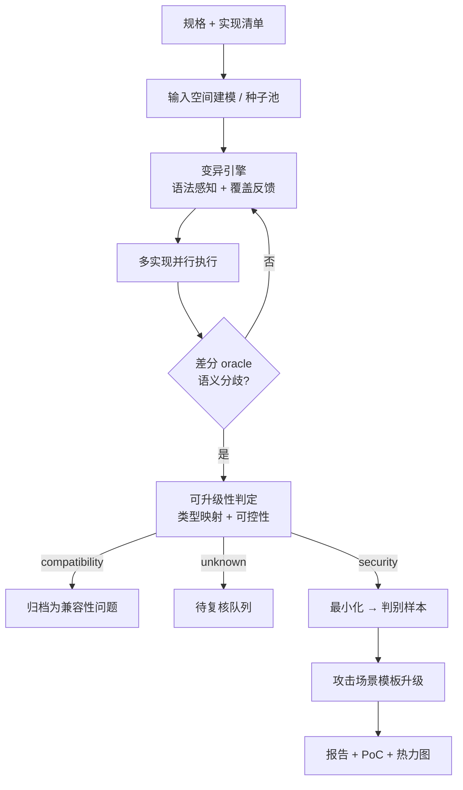

# 语义差分驱动的漏洞挖掘平台 — 技术方案

> **文档定位**：内部实施文档（工程向）
> **类别**：**漏洞挖掘（挖掘类，非防护类）**
> **服务场景（唯一，已锁定）**：我们作为服务提供商 → 客户把产品交给我们 → 我们检测**产品之间的耦合误差**
> **约束**：作品赛 · **15 天** · **4 人** · 无 GPU · **代码从零开始**

---

## 0. 类别定位：挖掘 vs 防护（先划清界限）

| | 防护类（本方案**不做**） | **挖掘类（本方案）** |
|---|---|---|
| 起点 | **已知**漏洞（CVE / 补丁） | **未知**，只有规格与多个实现 |
| 终点 | 受影响资产清单、修复排期 | **新发现的可触发漏洞** + PoC |
| 代表产物 | SCA / 影响面判定 / SBOM 治理 | 差分挖掘 / fuzzing / 漏洞研究 |
| 成功标准 | 漏报率、响应时间 | **发现了多少前人没发现的漏洞** |

**非目标**：不做资产治理、不做 SCA 增强、不做补丁回移监控、不做修复排期。这些是防护类的活儿，与本作品无关。

---

## 0.1 目标对象：差异出在组件之间，不在组件里

**目标对象不是"某个程序"，而是"同一规格的多个实现及其组成的链路"。**

> 单独看 nginx 没问题，单独看 gunicorn 没问题，`nginx + gunicorn` 就有 desync。
> **漏洞不在组件里，在组件之间的语义缝隙里。**

| 层 | 内容 | 本期范围 |
|---|---|---|
| 规格层 | HTTP/1.1 消息分帧（RFC 9112）、URL/路径归一化（RFC 3986 + 实现私有行为）、编码 / Unicode 归一化、序列化格式 | HTTP/1.1 分帧为主线；第二领域在 P3 落地 |
| 实现层 | **前置**：nginx / haproxy / Envoy / Apache httpd / Varnish<br>**后端**：Gunicorn、h11、hyper、Node `http`、Go `net/http`、Tomcat、Jetty、Werkzeug | 全部开源、可容器化、可离线快照 |
| **组合层** | 前置 × 后端 的 **N×M 链路对** | **≥ 8×8** —— 只有组合层才是漏洞的载体 |

**被探测的分歧轴（HTTP/1.1 分帧，可穷举）** —— 这是"15 天能做完"的原因：不泛泛 fuzz HTTP，而只打在有限且已知有分歧历史的语法点上。

- **Content-Length**：前导零、`+` 号、空白、超大值、重复头、非数字字符
- **Transfer-Encoding**：重复出现、非标准 token（`xchunked`）、大小写、多 TE 组合
- **CL 与 TE 同时存在时**的优先级（CL.TE / TE.CL / TE.TE 的根源）
- **chunk 语法**：chunk 扩展、大小进制、CRLF 变体（裸 LF）、结尾终止条件
- **头解析**：obs-fold 折行、头名前后空格、行终止符不统一
- **请求行**：绝对 URI vs 相对 URI、方法大小写

---

## 0.2 服务形态与输入输出契约（唯一场景）

| 项 | 内容 |
|---|---|
| **我们是谁** | 服务提供商（检测方） |
| **客户是谁** | 产品方（网关 / 中间件 / 云平台 / 集成商…） |
| **客户给什么** | ① 产品本身（**镜像**，黑盒，**不要求源码**）② 产品之间的**串联方式**（拓扑 + 关键配置） |
| **我们给什么** | **耦合误差报告**：误差清单 + 安全影响分级 + 最小复现样本 + 修复建议 |
| **不做什么** | 不扫域名、不做资产治理、不要求客户交出源码、不做未授权测试 |

### 核心概念：耦合误差

> **耦合误差 = 两个产品在串联处，对同一份数据的理解不一致。**

产品单独工作都正常，**串起来才出现**——所以客户自己测不出来（他们各自测各自的）。这正是这项服务的价值来源。

### 交付流程

```
1. 客户提交：产品镜像 + 拓扑（谁在前、谁在后、怎么转发）
2. 我们起容器，按客户拓扑真实串联
3. 灌入探测请求 → 收集每个产品的"理解"
4. 比对 → 找出耦合误差
5. 判定哪些有安全影响 → 生成最小复现样本
6. 交付报告：全量误差 + 安全分级 + 修复建议
```

**输入示例**

```yaml
domain: http1-framing
topology:                     # 客户真实的串联方式
  - product: customer-gateway:3.2     # 客户自研，客户提供镜像
    role: front
  - product: tomcat:10                # 开源，我们从公共仓库拉
    role: back
```

**关键约束**：客户给的是**镜像**而不是源码 → 全程黑盒使用。这既是客户能接受的信任边界，也正好匹配差分技术（不需要读代码）。

---

## 1. 核心洞察：挖掘的瓶颈是 **oracle**，不是变异

| 方式 | 判据 | 能发现什么 |
|---|---|---|
| 单实现 fuzzing | 崩溃 / sanitizer 报错 | **只有会崩的缺陷**；解析差异、鉴权绕过、过滤器绕过全漏 |
| **差分** | **两个实现对同一输入语义不一致** | 解析差异、归一化差异、边界解释差异 |
| **差分 + 可升级性判定** | 分歧 ∧ 攻击者可控 ∧ 有安全后果 | **请求走私 / 鉴权绕过 / WAF 绕过 / 缓存投毒** |

差分是唯一**不需要崩溃、不需要 LLM、不需要 GPU、不需要人工标注**的通用 oracle。

$$\text{漏洞} \iff \text{语义分歧} \;\wedge\; \text{分歧点攻击者可控} \;\wedge\; \text{存在安全后果}$$

**攻击者可控性**是抑制"兼容性噪音"的唯一有效过滤器——两个实现不一致但攻击者无法选择落到哪一侧的，是兼容性问题，不是漏洞。

---

## 2. 创新点

### 核心 ① 语义分歧的自动「可升级性判定」
- **现状**：差分测试产出大量"实现不同"的结果，人工逐个判断是否是漏洞，无法规模化，这也是差分技术长期停留在论文里的原因。
- **做法**：内置**分歧类型 → 安全后果**映射表（下表），结合"攻击者能否控制分歧点"做自动分类，把原始分歧分为 `security / compatibility / unknown`。
- **度量**：可升级比例、`security` 类的精确率。

| 分歧类型 | 安全后果 |
|---|---|
| 请求边界 / 长度解释 | 请求走私（CL.TE / TE.CL / TE.TE）→ 前置防护绕过 |
| 路径归一化 | 鉴权绕过（前置看 `/admin/../pub`，后端看 `/admin`） |
| 编码 / Unicode 归一化 | 过滤器绕过 → XSS / SQLi |
| 参数 / 类型解析 | 参数污染、类型混淆 → 认证绕过 |
| 错误处理 / 状态机 | 状态绕过、信息泄露 |

### 核心 ② 判别输入（distinguishing input）的自动构造与最小化
- **现状**：找到"两实现不一致"容易，找到**能稳定区分两者**的最小输入很难，人工调试耗时。
- **做法**：从种子变异出的候选 → 用差分 oracle 筛选 → **语义保持的 ddmin 最小化** → 输出最小判别样本。
- **新意**：判别样本本身就是可提交的 PoC 骨架。
- **度量**：最小化后的样本长度、判别稳定性（重复运行一致率）。

### 支撑 ③ N×M 组合矩阵的规模化编排
- **做法**：容器化每个实现，并行跑全组合矩阵，幂等复跑，输出热力图。
- **度量**：矩阵覆盖率、单组合平均耗时。

### 支撑 ④ 从分歧到攻击场景的自动升级
- **做法**：`security` 类分歧套用场景模板（走私 / 绕过 / 投毒）生成端到端 PoC。
- **度量**：可升级为可复现攻击的案例数。

### 核心 ⑤ 大模型的可实验性门槛（幻觉在类型上无法表达）
- **现状**：LLM 扫描器的通病是"说得像真的"。业界做法是提示词约束 + 人工复核，不可规模化；
  更糟的是让模型直接给结论，产出无法复核的判定。
- **做法**：把模型限制在**提案者**位置，且每条提案必须连过两道机械门槛 ——
  ① 语法/白名单编译；② **差分 oracle 准入实验**（真的逼出结构分歧才算命中）。
  没通过第二道门槛的提案在结果里根本不存在。
- **为什么是真创新**：幻觉不是被"抑制"，而是**在类型上写不出来**
  （`Proposal` 里没有任何判定字段），且活不过一道确定性实验。
- **度量**：提案可编译率、**命中率**（逼出分歧的提案 / 全部提案）、模型提案产出的 `security` 级误差数；
  并与手写轴用**同一把尺子**对照。
- **副产品**：命中率台账可作为"下一轮往哪搜"的输入（命中过的轴族优先扩展）。

---

## 3. 技术点（模块 → 成熟底座 → 自研增量）

| # | 模块 | 成熟技术（直接用） | 自研增量（评审看点） |
|---|---|---|---|
| 1 | 领域适配器 | HTTP 解析链、URL/路径归一化、编码/Unicode、序列化 | **规格建模 + 输入空间描述**（如何变异才落在分歧点上） |
| 2 | 变异引擎 | AFL++ / libFuzzer、Nautilus / Grammarinator 语法生成、模板变异 | 面向**分歧探测**而非崩溃的变异策略与反馈 |
| 3 | 差分 oracle | 多实现执行 + 结果归一化 | **结果等价性定义**（哪些差异算"语义分歧"而非表现差异） |
| 4 | 可升级性判定 | 规则引擎 | **分歧→安全后果映射表 + 攻击者可控性判定**（核心资产） |
| 5 | 最小化 | ddmin | 语义保持约束（最小化后仍必须保持分歧） |
| 6 | 编排 | Docker / docker-compose、任务队列 | 矩阵调度、幂等复跑、结果去重 |
| 7 | 报告 | JSON / Markdown | 分歧证据 + 判别样本 + 攻击升级路径 |
| 8 | 模型提案层 | OpenAI 兼容 HTTP（urllib） | **两道机械门槛**：语法/白名单编译 + 差分 oracle 准入实验；命中率台账（模型 vs 手写轴同口径） |
| 9 | 扫描控制台 | Python 标准库 `ThreadingHTTPServer` | 后台任务 + 手写 `text/event-stream` 事件流；**模型文字与确定性证据分栏**渲染 |

**技术栈**：Python（编排与判定）+ Docker（实现隔离）+ AFL++/libFuzzer（变异）+ 各语言原生实现（差分对象）。**不需要 GPU。**

大模型是可插拔的**旁路**：它只提案（往哪里搜），判定权完全在内核。
不配置模型时全链路自动降级为纯确定性模式，扫描照跑、报告照样出 ——
详见 §12「大模型辅助层：边界契约」。

---

## 4. 系统架构



---

## 5. 接口契约与数据模型

### 5.1 领域适配器接口

```python
class DomainAdapter(Protocol):
    def implementations(self) -> list[ImplSpec]: ...      # 参与差分的实现
    def seed_pool(self) -> list[bytes]: ...               # 初始语料
    def mutate(self, seed: bytes) -> Iterator[bytes]: ... # 语法/状态感知变异
    def normalize(self, impl: ImplSpec, out) -> Canon: ...# 结果归一化（关键：定义"等价"）
    def classify(self, divergence) -> Kind: ...           # 分歧 → 类型映射
```

### 5.2 数据模型（SQLite）

| 表 | 关键字段 |
|---|---|
| `impl` | impl_id, name, version, image_ref, role(前置/后端/库) |
| `case` | case_id, adapter, payload, minimized_len, stable_rate |
| `divergence` | case_id, impl_a, impl_b, kind, canonical_diff |
| `verdict` | divergence_id, level(security/compat/unknown), reason, cwe |
| `poc` | divergence_id, scenario(desync/bypass/poison), script_path, verified |

---

## 6. 指标体系

| 类别 | 指标 | 目标 |
|---|---|---|
| 挖掘产出 | **确认的可升级漏洞数** | ≥ 3（含 ≥1 端到端可复现攻击） |
| 有效性验证 | **已知漏洞再发现率** | 对已知 desync/绕过案例，平台能重新挖出 ≥ 1 个 |
| 效率 | 原始分歧 → 唯一分歧的压缩比 | 优化后显著下降（去重 + 最小化） |
| 精度 | `security` 类判定的精确率 | ≥ 60% |
| 规模 | 客户拓扑链路覆盖 / 交叉矩阵覆盖 | 客户链路 100%；交叉矩阵 ≥ 8×8 |
| 速度 | 单组合单 case 平均耗时 | 秒级 |

**可靠性验收方式（关键）**：用**已知漏洞反验证**——平台能否重新发现公开的请求走私 / 路径绕过案例。这解决"挖不到就等于没用"的举证难题：**先证明能复现已知，再证明能发现未知。**

---

## 7. 里程碑与排期（15 天 · 4 人）

**三阶段，每阶段 5 天；阶段末冻结，产出可运行版本。**

| 阶段 | 天数 | 目标 | 阶段末验收（客观可查） |
|---|---|---|---|
| **P1 最小闭环** | D1–D5 | 一条链路 + 2 个实现跑通差分 | ≥ 10 个误差，人工确认 ≥ 3 个真实 |
| **P2 判定与规模** | D6–D10 | 判定器 + 最小化 + 交叉矩阵 + 内部基准反验证 | ≥ 6 实现接入；误差自动分级；1 例已知案例被重新挖出 |
| **P3 攻击升级与交付** | D11–D15 | 端到端复现 + 报告 + 演示 | ≥ 3 个 `security` 误差，≥ 1 个端到端复现；报告 / 视频 / 离线快照齐全 |

### P1 最小闭环（D1–D5）

| 天 | A 领域与变异 | **B 差分与判定 ★关键路径** | C 编排与复现 | D 基准与交付 |
|---|---|---|---|---|
| D1 | 6 类分歧轴 → 探测模板骨架 | 定义「视角」数据结构 + 归一化初稿 | **docker-compose 起最小链路**（前置 → 探针后端） | 仓库骨架、开发环境、锁定镜像版本表 |
| D2 | 定向变异器 v0 | 两实现的视角探针设计 | 探针后端（记录原始字节 → 输出视角） | 收集 3 个公开走私案例作反验证用例 |
| D3 | 种子池 + 样本生成（≥ 500） | 差分比对器 v0 | 结果落库（SQLite 表结构落地） | 已知案例改造成平台输入格式 |
| D4 | A+B 联调 | A+B 联调 | 复跑幂等性 + 去重 | 误差人工复核表（`security`/`compat`/`unknown`） |
| D5 | **集成日** | **集成日** | **集成日** | **集成日** |

**D5 检查点**：现场跑最小闭环 → ≥ 10 个误差，人工确认 ≥ 3 个真实。

### P2 判定与规模（D6–D10）

| 天 | A 领域与变异 | **B 差分与判定 ★关键路径** | C 编排与复现 | D 基准与交付 |
|---|---|---|---|---|
| D6 | 接入更多前置实现（haproxy / Envoy） | 可升级性判定器 v1（分歧→后果映射表落地） | 拓扑 YAML 驱动起链路 | 交叉矩阵设计与编排 |
| D7 | 接入后端实现（Tomcat / Go / h11） | 攻击者可控性判定 | 并行调度 | 内部基准反验证第一轮 |
| D8 | 变异反馈优化（分歧导向） | 分级精度评估（人工标注 vs 自动判定） | 最小化（ddmin + 语义保持） | 指标面板（自动统计） |
| D9 | 补充样本 | 阈值标定 | **离线快照**（`docker save` 全部镜像） | 指标数据落表 |
| D10 | **集成日** | **集成日** | **集成日** | **集成日** |

**D10 检查点 = 范围砍伐决策点**：≥ 6 实现接入、误差自动分级、≥ 1 例已知案例被重新挖出。**未达标即砍掉 P3 的第二领域，保交付。**

### P3 攻击升级与交付（D11–D15）

| 天 | A 领域与变异 | B 差分与判定 | C 编排与复现 | D 基准与交付 |
|---|---|---|---|---|
| D11 | 第二领域最小可跑 | 攻击场景模板（走私 / 绕过） | PoC 复现编排 | 报告模板（误差 + 分级 + 修复建议） |
| D12 | 补充样本 + 复核 | B+C 打通端到端 PoC | B+C 打通端到端 PoC | 文档初稿 |
| D13 | **功能冻结** | 修 bug | 修 bug | 报告自动生成接入 |
| D14 | 彩排 | 彩排 | 全量离线复跑 | 录屏 + 视频备份 |
| D15 | **交付** | **交付** | **交付** | **交付** |

**D15 交付物**：演示 + 说明书 + 演示视频 + 离线快照包 + 误差报告样例。

---

## 8. 分工与关键路径（4 人）

| 成员 | 角色 | 主责阶段 | 核心交付物 |
|---|---|---|---|
| A | 领域与变异 | P1、P3 | 分歧轴模板、变异器、种子池 |
| **B** | **差分与判定** | **P1–P3（关键路径）** | **归一化定义、可升级性判定器——平台的知识资产** |
| C | 编排与复现 | P1–P3 | 容器编排、拓扑驱动、最小化、离线快照 |
| D | 基准与交付 | P1–P3 | 内部基准反验证、指标面板、报告、演示与文档 |

### 关键路径与依赖（必须遵守）

1. **C 的容器编排（D1–D3）阻塞所有人** —— 它不到位，A / B / D 全部停摆。C 必须最先交付。
2. **B 的归一化定义与判定器不可延期** —— 它是"误差算不算漏洞"的唯一裁判，也是本作品的核心知识资产。
3. **D 的反验证用例（D2）要早** —— 决定平台能否自证有效，越晚做风险越大。
4. 每日 15 分钟站会；每阶段末冻结，未完成项转入下阶段或直接砍掉。

---

## 9. 风险与兜底

| 风险 | 概率 | 应对 |
|---|---|---|
| 分歧多为兼容性噪音 | 高 | **攻击者可控性判定**是核心过滤器；宁可漏报不可滥报，`unknown` 进复核队列 |
| 环境编排成本超预期 | 中 | docker-compose 预置镜像**离线快照**，不依赖现场拉取 |
| 15 天内挖不到未知漏洞 | 中 | 用**已知漏洞再发现**作为可靠的验收基线；未知发现是加分不是生命线 |
| 归一化定义过松/过严 | 中 | 过松 → 噪音爆炸；过严 → 漏掉真实分歧。用已知案例标定阈值 |
| 演示现场翻车 | 中 | 预录视频 + 全离线矩阵复跑 |

---

## 10. 服务定位：产品耦合误差检测（唯一场景）

**一句话**：客户把产品交给我们，我们找出它们**串联时的耦合误差**。

### 客户为什么自己测不出来

| 客户能测的 | 客户测不了的 |
|---|---|
| 单个产品的功能、性能、自身的已知漏洞 | **两个产品串起来之后的语义不一致** |
| A 单独跑正常，B 单独跑也正常 | A + B 一起跑才出现的缝 |

### 客户画像

| 客户 | 典型的"产品串联" |
|---|---|
| 网关 / 中间件厂商 | 自研网关 → 自研服务框架（或用了 nginx） |
| 云厂商 / 平台方 | 负载均衡 → API 网关 → 微服务运行时 |
| 集成商 / 政企 | 多个厂商的产品拼成一套系统 |
| 车机 / 嵌入式 | 多个组件串在同一条数据链上 |

### 测试范围（两类组合）

| 组合 | 目的 |
|---|---|
| **客户真实拓扑链路** | 直接对应客户生产环境，必测 |
| **客户产品 × 参考实现矩阵** | 放大发现能力——同一产品也可能与其它实现耦合不一致，暴露客户尚未遇到的场景 |

第二类很关键：只测客户自己那条链，样本太少容易漏；把客户产品与一批标准实现交叉组合，一次能给客户更多价值。

### 交付物

**耦合误差报告**：全量误差清单 + 安全影响分级（`security` / `compatibility` / `unknown`）+ 最小复现样本 + 修复建议。

### 内部基准（不交付，仅用于证明平台有效）

公开组件矩阵（nginx / haproxy / Envoy / Tomcat / gunicorn …），用**已知的请求走私案例反验证**：平台能否重新挖出公开案例。这是平台有效性的证据，不是交付内容。

---

## 11. 演示脚本（2 分钟）

**场景**：客户提交两个产品——自研网关 + 一个开源运行时——声称线上串着用。

1. 加载客户产品镜像与拓扑（网关在前、运行时在后）。
2. 启动差分探测（离线预置镜像），实时显示误差计数上升。
3. 点开一条误差：对照两个产品对同一段字节的**不同理解**。
4. 平台自动分级为 `security`，生成**最小复现样本**，在串联链路上复现"一段数据被夹在两者之间"。
5. 导出报告：误差清单 + 安全分级 + 最小复现样本 + 修复建议。

---

## 12. 大模型辅助层：边界契约（可测试的不变式）

> 一句话：**大模型只提案，内核只裁决；不可实验的提案进不了结果。**

这是"用大模型"与"被大模型带偏"的分界线。它不是提示词纪律，而是**代码级不变式**。

### 12.1 类型隔离

```python
@dataclass(frozen=True)
class Proposal:          # ced/contracts.py
    axis: str
    payload: bytes
    origin: str          # handwritten | llm
    rationale: str
    model: str
    # 没有 level / cwe / scenario / controllable —— 判定字段在类型上就不存在
```

- `Verdict` 的唯一生产者是 `ced/classify/upgradability.py::judge()`。
- 模型输出先过 `ced/assist/schema.py` 的严格校验：未知字段、轴名不合规、与手写轴重名、
  同批重复 —— **逐条丢弃并留痕**，不影响其余条目。

### 12.2 两道机械门槛

| 门槛 | 位置 | 判据 | 不通过 |
|---|---|---|---|
| ① 语法/白名单 | `assist/compile.py::framing_relevant` | 能解析成一条 HTTP 消息，且落在分帧语法点上（CL/TE 写法与优先级、chunk 语法、头语法、请求行），且必须是**非规范**写法 | 丢弃，记「不可编译」 |
| ② 差分 oracle 准入实验 | `assist/compile.py::admit` | 把候选字节真的喂给本地对照对，**真的逼出结构分歧** | 丢弃，记「未命中」 |

只有连过两道门槛的提案才会以 `extra_cases` 进入 `pipeline.scan`，
并且**带上它自己的轴名**（归因清晰，可回溯到是哪条提案逼出的发现）。
与内置语料重合的提案会被去重，实际入池条数以 `ScanResult.proposed_cases` 为准。

### 12.3 可度量的产出

台账（SQLite `proposal` 表）记录：提案数 / 可编译数 / 命中数 / 命中率，按来源分开统计。
**命中 = 逼出结构分歧**，由内核给出，不看模型自述。
扫描时先用同一把尺子量一遍内置手写轴，给出可比基线：

```
提案 33　可编译 31　命中 15　命中率 45%
  模型   提案 4　命中 2　命中率 50%
  手写   提案 29　命中 13　命中率 45%
```

### 12.4 降级路径（现场演示的保险）

| 情况 | 行为 |
|---|---|
| 未配置 `CED_LLM_*` | 提案返回空，扫描只用内置轴 —— **不影响结果正确性** |
| 模型不可达 / 超时 / 返回结构不符 | 包成 `LlmUnavailable`，记一条「模型不可用」留痕，扫描继续 |
| 删掉整个 `ced/assist/` 目录 | 引擎、报告、控制台照跑（该层是旁路，不是依赖） |

### 12.5 合规边界

只把**公开语料**发给模型：RFC 分帧语法、已有轴名列表、命中率摘要。
**不发客户镜像、不发原始流量、不发客户拓扑文件。**

### 12.6 新增命令与接口

| 命令 / 接口 | 用途 |
|---|---|
| `python -m ced assist [--status]` | 模型配置状态 |
| `python -m ced assist --propose N` | 要 N 条提案并逐条跑准入实验 |
| `python -m ced assist --ledger` | 提案命中率台账 |
| `python -m ced scan --llm` | 带模型提案跑一次扫描 |
| `GET /api/assist/status` · `GET /api/assist/ledger` · `POST /api/assist/propose` | 控制台提案接口 |
| `POST /api/scan/start` · `GET /api/scan/events`（SSE）· `GET /api/scan/result` · `POST /api/scan/abort` | 扫描任务与事件流 |

配置（任何 OpenAI 兼容端点）：

```bash
CED_LLM_BASE_URL=https://api.deepseek.com/v1
CED_LLM_MODEL=deepseek-chat
CED_LLM_API_KEY=sk-...
```

---

## 13. 本轮新增能力（与实现对齐）

### 13.1 攻击场景升级：端到端 PoC（补齐 §2 创新点④）

模块：`ced/scenario/`（`templates.py` 场景数据 + `poc.py` 生成）。

- **只对 `security` 级发现升级**。`unknown` / `compatibility` 一律不出 —— 判定器没升级的，
  这里不许替它升级。有测试守着（`TestNoOverstatement`）。
- 每个 PoC 三件套：**叙事**（场景 / 影响 / 前提 / 步骤）、**字节归属**
  （前置转发 / 后端消费 / 夹带，数字来自 `orchestrate.chain` 的链式模型）、
  **可执行脚本**（零依赖，离线算账；`--send HOST:PORT --i-am-authorized` 才真发）。
- 落库表 `poc`（见 §5.2 数据模型），落盘默认 `results/pocs/poc_<case_id>.py`。
- 命令：`python -m ced poc <case_id>`；`scan` 与 `agent` 自动产出全部 PoC。

### 13.2 指标与交叉矩阵热力图（补齐 §2 支撑③、§6 指标体系）

模块：`ced/metrics.py`。

- `scan_metrics(result, elapsed)`：安全占比、**可控性证据率**、唯一化压缩比、
  最小化压缩比、单用例平均耗时 —— 口径写死在实现里，报告与前端共用。
- `matrix_heatmap(result, impl_ids)`：N×N 矩阵，**对称**（同一条发现在 `[左][右]` 与
  `[右][左]` 都记），对角线为空；格子按最严重级别与命中数染色。
- 控制台：`/api/scan/metrics`、`/api/scan/heatmap` + 指标卡与热力图面板。

### 13.3 闭环 agent（把"开环提案"接成闭环）

模块：`ced/agent/`（`tools.py` 工具表 + `loop.py` 编排）。

- 工具：`scan_corpus` / `propose_axes` / `inspect` / `ledger` / `finish`。
  **每一个工具都只返回数据**；没有任何工具能写出 `level` / `cwe` / `scenario`。
- 预算：`max_rounds`（默认 4）× `max_tool_calls`（默认 12），硬上限，跑飞会被截断。
- 工具入参过白名单；模型给错名字/错参数一律记成 `ok=false` 的观测喂回去让它自己改。
- 无模型 → 降级为单轮确定性扫描，**结果与不带 agent 完全一致**。
- 命令：`python -m ced agent --rounds 4 --max-calls 12`。

### 13.4 链路语义修正：前置拒绝 ≠ 链路故障

`ced/probe/errors.py` 新增 `ProbeRejected`，与 `ProbeUnreachable` 分开：

| 情况 | 判据 | 处置 |
|---|---|---|
| 链路故障 | 前置不可达 / 探针控制口不通 | `ProbeUnreachable` → **中止**，不产出任何结论 |
| 前置拒绝 | 前置回了响应，但探针没有视角 | `ProbeRejected` → **跳过该用例并计数**（`ScanResult.rejected_cases`） |

为什么必须分开：真实 nginx / Envoy 对畸形请求返回 4xx 且不向后端转发，属正常行为。
若当作链路故障，一轮扫描会在第一条畸形请求上崩掉，对真实产品完全不可用。
跳过**不合成观测**，也不静默 —— 计数会出现在 CLI 输出、报告与 `result_payload` 里。

### 13.5 无 Docker 的真实链路（现场兜底）

- `ced/probe/front.py`：替身前置。模式 `pass` / `rewrite_cl` / `drop` / **参照实现策略名**。
  最后一档让"前置按自己的策略定帧、后端按另一套策略再定帧"真的发生在两个进程之间。
- `python -m ced serve --front --front-mode ref-te-first --policy ref-cl-first --front-port 18080`
  一条命令起链路；配 `ced/topologies/standin-front.yaml` 即可扫描。
- 真实 Docker 链路见 `docker/`，**本机无 Docker，交由队友按 `docs/队友交接清单.md` 验证**。
