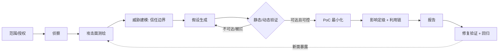

# 漏洞挖掘步骤

> 核心纪律：**以可达性（reachability）为主轴的数据流分析，而不是模式匹配清单。**
> 先证明攻击者可控数据能到达危险操作，再谈危害。
> 静态告警未证明可达 = 假阳性，不算漏洞。

---

## 0. 前置：边界与授权

- 明确 **在范围内** 的资产 / 仓库 / 端点，禁止动作（DoS、数据破坏、越权访问真实用户数据），时间窗，报告渠道。
- 落盘：目标清单 + 授权凭据 + 环境快照（版本 / commit hash）。
- **版本不固定，漏洞就不可复现。**

交付物：授权范围文档、目标清单、环境快照。

---

## 1. 侦察 Recon

| 维度 | 动作 |
|---|---|
| 外部 | 子域 / 端口 / 服务 / 技术栈指纹。被动收集与主动扫描分离，主动扫描易触发告警 |
| 内部（源码） | 语言 / 框架 / 依赖版本、构建方式、部署形态（谁监听、谁鉴权） |
| 历史 | 历史 commit、已知 CVE（`grype` / `osv-scanner` / `npm audit` 类工具） |

交付物：**资产与版本矩阵**。不知版本，后续所有结论都不可证。

---

## 2. 攻击面测绘 Attack Surface

- 枚举 **入口点**：HTTP 路由 / 参数 / 头 / Cookie、CLI 参数、文件解析、RPC / IPC、消息队列、反序列化、插件 / 模板、定时任务、DB 权限。
- 标注入侵者可控性：哪些字节由外部输入决定（attacker-controlled source）。
- 产出：入口点 → 数据流 → 危险汇（sink）的候选映射。

---

## 3. 威胁建模：找信任边界

- 画数据流图（DFD），标出每个 **信任边界**：网络→应用、应用→DB、租户→租户、用户→内核、进程→特权进程。
- 假设每条边界都可能在缺校验 / 缺鉴权 / 类型混淆处被穿透。
- 对每个资产问三件事：C / I / A 谁受影响？谁能调用？前置条件是什么？

---

## 4. 假设生成（从上到下的模式清单）

按类别产出**可验证假设**，而不是泛泛的"可能有漏洞"：

- **注入**：SQL / 命令 / LDAP / XPath / 模板（SSTI）/ 日志注入。
- **鉴权与授权**：IDOR、水平 / 垂直越权、JWT 校验缺陷、会话固定、CORS / CSRF。
- **内存与类型**：越界 / UAF / 整数溢出、反序列化、原型污染。
- **路径与文件**：目录穿越、任意文件读写、Zip Slip、SSRF → 文件读。
- **加密**：弱随机、固定 IV / 密钥硬编码、时序侧信道、签名校验可绕过（`alg=none`）。
- **配置与逻辑**：默认口令、调试端点、竞态（TOCTOU）、金额 / 配额逻辑绕过、幂等缺失。

---

## 5. 验证：静态 vs 动态

| 手段 | 用途 | 工具面 |
|---|---|---|
| 源码审计 | 数据流 source→sink、可达性 | CodeQL、Semgrep、Joern、IDE 跳转 / 引用（`xd://lsp` 查定义 / 引用 / 类型） |
| 动态探测 | 黑盒 / 灰盒验证 | Burp / ZAP、ffuf、nuclei、自写请求脚本 |
| 模糊测试 | 解析器 / 协议 / 二进制 | AFL++、libFuzzer、OSS-Fuzz、boofuzz |
| 运行时检测 | 定位内存 / 并发缺陷 | ASan / UBSan / MSan / TSan、Valgrind、GDB / WinDbg（`xd://debug`） |

- 关键：**证明可达**。静态告警未证明可达 = 假阳性。
- 每个假设都要有 **反证记录**（为什么不可达 / 被校验拦住），避免重复劳动。

---

## 6. PoC 构造与最小化

- 从「可疑」到「确定」：构造**最小可复现输入**，去掉无关步骤。
- PoC 必须包含：前提条件、精确请求 / 输入、预期 vs 实际、依赖版本。
- 二进制类：保留崩溃样本 + 栈回溯 + 触发命令；确认可重复触发，而非一次性偶发。

---

## 7. 影响评估与定级

- 判定 CIA 影响面 + 是否需要前置条件（认证 / 交互 / 本地）。
- 尝试 **利用链**：单点低危（如 SSRF）叠加后是否升级为 RCE / 数据泄露。
- 用 CVSS 给向量分；说明误报可能性与边界假设。

---

## 8. 报告与交付

结构化：

1. 标题
2. 影响
3. 复现步骤
4. PoC
5. 证据（日志、抓包、崩溃栈）
6. 修复建议
7. 参考

纪律：**不夸大**。未验证的推论标注为推断，不写成已验证结论。

---

## 9. 修复验证与回归

- 拿到补丁后重新跑同一 PoC，确认失效。
- **新增回归测试固化该场景**（针对具体易错边界，不做泛化）。
- 检查同类代码路径是否同源缺陷——一个注入点往往有 N 个兄弟。

---

## 流程总览

---

## 最容易踩的两条坑

1. **只做模式匹配不验可达** → 产出大量假阳性。
2. **不锁版本 / 环境** → 漏洞无法复现，也无法验证修复。

---

# 创新空间：哪一步最值得投入

**结论：创新空间集中在「假设生成」（第 4 步）、「信任边界建模」（第 3 步）、「验证 oracle」（第 5 步）。**
第 0 步和第 8 步基本没有空间——它们是流程 / 法律约束，不是技术问题。

## 判据：哪里能创新

创新空间 ∝ **搜索空间是否无界** × **反馈是否可得**（能否快速验证对错）× **现有工具覆盖是否稀疏**。
三者都满足的位置就是创新点；任意一项为 0 的位置只能做工程优化。

| 步骤 | 创新空间 | 瓶颈在哪 | 已发生的创新（例） |
|---|---|---|---|
| 0 授权 / 边界 | 几乎为 0 | 法律、流程 | — |
| 1 侦察 | 中 | 覆盖度、优先级排序，不是深度 | Shodan / Censys 类被动测绘、供应链（包仓库）枚举 |
| 2 攻击面测绘 | 高 | 端点 / 参数 / 接口的自动发现，**版本差分** | patch diffing、二进制可达性、API schema 反推 |
| 3 信任边界建模 | **很高** | 边界通常是**隐式**的，没人写下来 | 规格 vs 实现差分、多租户键推断 |
| 4 假设生成 | **最高** | 新**漏洞类别**由人发明，不在任何清单里 | 原型链污染、请求走私 / desync、SSRF → 云元数据、提示注入、推测执行侧信道 |
| 5 验证 | **很高** | oracle（怎么知道“这是 bug”）与可达性 | sanitizer、覆盖引导 fuzz、差分 / 蜕变测试 |
| 6 PoC | 中高 | 自动化程度 | 最小化、约束求解生成的 PoC |
| 7 定级 / 利用链 | 高 | 组合爆炸 + 真实配置下的可达性 | 自动 chaining、exploitability 判定 |
| 8 报告 | 低 | 文案 | 去重 / 重复漏洞识别（bug bounty 场景） |
| 9 回归 | 中 | 测试合成 | 不变量抽取、自动加固 |

## 为什么是这三点

**第 4 步「假设生成」= 发明新类别。**
清单里的条目（SQLi、XSS）已经被工具吃干，价值趋近于零；真正的产出是**从已有 bug 泛化出模式**——看到一次 desync 就想到“所有对消息分帧有歧义的地方”，看到一次原型污染就想到“所有从 JSON 到对象图的合并操作”。
可动手方向：

- 用 CVE 语料反推 pattern。
- **同源项目的补丁回移缺口挖掘**（A 修了，fork 的 B 没修）。
- 跨语言把同一模式迁移（Python `pickle` → Java `readObject` → JS `Object.assign` 深合并）。
- LLM 生成假设 + 执行反馈闭环筛选，让假设自动产生可验证探针。

**第 3 步「信任边界」= 边界是隐式的。**
文档不会写“这个字段跨租户共享”，只有代码里 `WHERE tenant_id = ?` 少了才知道。
创新在于：

- **自动推断实现的隐式边界**（多租户键、沙箱 syscall 白名单、权限模型的传递闭包）。
- **规格 vs 实现差分**。
- **配置态边界**——默认配置、危险但“合法”的开关组合，往往才是真实攻击面。

**第 5 步「验证」= oracle 决定上限。**
挖不到不代表没有，而是没有**判据**。历史上最大的几次能力跃迁都来自新 oracle（ASan 之于内存、差分测试之于解析器）。
可动手方向：

- 真实性 oracle（回放真实流量、差分两版本 / 两实现）。
- 结构感知与状态机推断 fuzzing。
- **从 sink 反推到入口的可达性判定**（结合 `xd://lsp` 引用链 / CodeQL 数据流）。
- 自动 exploitability triage——把“崩溃”翻译成“危害”。

第 7 步的利用链自动化与这步共享同一套可达性基础设施。

## 不值得做的“创新”

- 再写一个基于正则的密钥 / 危险函数扫描器 → 精度噪声已经淹没信号。
- 又一套 YAML 模板的模板库 → 覆盖率提升靠的是类别，不是条目数。
- 在报告层加排版 / 可视化 → 第 8 步，杠杆最低。

## 一个可操作的筛选标准

> 这个创新是提升 **recall（找到更多人找不到的）**，还是提升 **precision（少报假阳性）**，还是**降低单位发现的成本**？
> 三条都不沾 → 不是创新，是装修。
